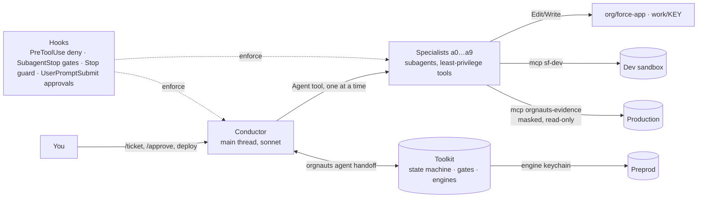

# Orgnauts · by Khadda AI Labs

**An AI crew that integrates with Salesforce. Go / No-Go for every change.**

[](https://github.com/KhaddaAiLabs/orgnauts/actions/workflows/ci.yml)
[](LICENSE)
[](package.json)
[](docs/SETUP.md)

Orgnauts turns one Claude Code session into a Salesforce team: an intake analyst reads your ticket, a reproduction engineer
proves the bug with a failing test, an architect plans, a developer builds in **your development sandbox only**, a QA engineer
tests, a reviewer signs off and a comms writer drafts the words — each a Claude Code subagent with one job and the fewest
tools possible, walked through 19 fixed stages by a conductor. Every stage ends in a **Go / No-Go** taken by mechanical gates
(tests, lints, hash comparisons), never by the model's opinion, and every risky step waits for **you**. Production is read-only,
deploys are yours, and no real e-mail can leave a sandbox.

## Prerequisites

| You need | Why | Check |
|---|---|---|
| Node.js ≥ 20.10 | runs the toolkit | `node --version` |
| Salesforce CLI (`sf`) | every org call goes through it | `sf --version` · install: `npm i -g @salesforce/cli` |
| git | the toolkit reads your repo history and remotes | `git --version` |
| Claude Code (`claude`) | the agents run inside it | `claude --version` |
| A tracker — **one** of: the Atlassian (Jira) MCP server connected in Claude Code · any other tracker with an MCP server · no tracker at all (tickets as files in `inbox/`) | the intake agent reads the ticket; Orgnauts never holds a tracker token | `claude mcp list` |
| One development sandbox you are allowed to break | the only org agents write to | `sf org list` |

`orgnauts-human doctor --preflight` prints this table for your machine (setup runs it before its first question). Optional:
python3 (Phase 0 spikes) and Playwright (browser QA in preprod). macOS and Linux only — Windows is not supported (sh launchers,
`HOME` override).

## Quick start — 15 minutes

```bash
git clone https://github.com/KhaddaAiLabs/orgnauts.git && cd orgnauts
npm run setup                                   # npm ci → build → ~/.orgnauts/bin (the copy the hooks run) → 5-question wizard
export PATH="$HOME/.orgnauts/bin:$PATH"         # add it to your shell profile too

orgnauts-human org login --alias DevSandbox --keychain agent    # browser login to YOUR development sandbox
export ORGNAUTS_CANARY_EMAIL=you@yourcompany.example           # the e-mail canary's only recipient: your own address
orgnauts-human doctor                                           # boot checks: config · keychain · hooks · tracker · canary

# in Claude Code, once (type the whole line — `/plugin` alone opens the interactive manager):
#   /plugin marketplace add ./
#   /plugin install salesforce-development@orgnauts-pinned

orgnauts-human start                            # launches the conductor session
> /ticket PROJ-123
```

The wizard asks five things: the **development sandbox alias**, your **tracker project key**, the **test e-mail patterns**
that may appear in test data (`*@example.com, *.invalid` — add your own address pattern), the **tracker** (`mcp`, the default:
tickets are read through the MCP server you name, `atlassian` by default; or `jira` with a REST token; or `file`) and a
**preprod alias** (default `none` — a development-sandbox-only start is fine). No tracker? Choose `file` and drop
`inbox/PROJ-123.md` (template: `templates/inbox-ticket.md`). Preprod, the production read-only user and the full wizard:
**[docs/SETUP.md](docs/SETUP.md)**.

## How a ticket flows

```
open → prior art → intake → baseline sync → cartography → reproduce → plan → develop → QA (dev) → review → comms
  → deploy to preprod (you) → preprod parity → QA (preprod) → deploy to production (you) → production verify
  → remediation (you, only if the plan has one) → score + learn → done
```

Nineteen stages, one conductor. **Your steps:** approve the intake and the plan when a gate asks (`/approve PROJ-123`,
`/reject PROJ-123 --reason "…"`), deploy to preprod and to production with **your own release tool** using the component list
in `work/PROJ-123/06c-deploy-manifest.md`, then tell the toolkit (`orgnauts-human deployed PROJ-123 --org preprod`); after a
preprod deploy the toolkit retrieves the same components and compares fingerprints before QA runs there. When the conductor
stops, `orgnauts agent status PROJ-123` says why and `orgnauts-human ui` shows it. **Pictures:** the intake and the plan each
render a page you can open in a browser — `work/PROJ-123/visuals/intake.html` (the issue, what to do, one example, two
diagrams) and `work/PROJ-123/visuals/plan.html`.

## Your controls

- **Per-agent approval switch** — `orgnauts-human autonomy set <agent> ask|auto|inherit`: stop for `/approve` after this agent,
  never stop, or follow the tier matrix in `config/autonomy.yaml`. `orgnauts-human autonomy show` prints the current matrix.
  Deploys and remediation are always yours (hard floor).
- **Which org the baseline comes from** — with several preprod orgs, answer the baseline question with the alias:
  `/approve PROJ-123 --stage baseline --answer "source:UAT"` (or `orgnauts-human baseline decide PROJ-123 --source UAT`). The
  toolkit copies that org's version of each component into the dev sandbox before work starts and tells you when a refresh is needed.
- **Safety screen** — `orgnauts-human ui` → ⛨ Safety: the allowed test e-mail patterns, the e-mail containment mode (`blocked` /
  `allowlist_only`) and the canary state. The same values live in `config/safety.yaml`.
- `/hold`, `/resume`, `/feedback "lesson"`, `orgnauts-human lessons review` — the human side of learning.

## What is new in v0.3.0

- **Tracker through MCP, no Jira token.** `tracker.adapter: mcp` (the default): the intake agent reads the ticket with the
  tracker's own Claude Code MCP server (Atlassian by default — any tracker with an MCP server works) and imports it into the vault.
  Orgnauts never holds a tracker credential; write tools are denied.
- **Per-agent approval switch** — `orgnauts-human autonomy set <agent> ask|auto|inherit`.
- **Intake and plan visuals** — `work/<KEY>/visuals/intake.html` and `plan.html`, rendered from the stage contract and checked by a gate.
- **Baseline from the org you choose**, with a "refresh needed" check when the baseline is older than the org.
- **QA in preprod with the browser**, after the toolkit verified that your deploy brought every component (fingerprint parity).
- **Honest offline test suite** — `npm test` sets `ORGNAUTS_OFFLINE=1`: no `sf` call leaves the suite, nothing pings your keychain;
  doctor 9h proves it and doctor itself skips org checks loudly instead of silently when offline.
- **Hardened policy hook** — the PreToolUse deny hook that keeps agents on the development sandbox.
- **Quick setup** — `npm run setup`, `orgnauts-human setup --quick`, a prerequisites table before the first question
  (`doctor --preflight`), and doctor 2h (plans are checked against `org/sfdx-project.json` → `sourceApiVersion`; it must match your org).

## Safety in one paragraph

Production is reached by exactly one identity — a **read-only user** you create — through one **masked, logged evidence channel**
(`orgnauts-evidence` MCP); no agent has a production login, deploy path or write tool, and `orgnauts-human doctor --p1` fails if that
user can modify data or metadata. Agents deploy to the **development sandbox only**: the policy hook, the generated `.mcp.json` and static deny
rules refuse every other org, and preprod sits in a separate **engine keychain** (`~/.orgnauts/engine`) agents cannot read.
**Humans deploy** with their own release tool; the toolkit then checks what arrived. **Zero real e-mail:** only the addresses you
allow may appear in test data, a canary proves the sandbox refuses to send (or a census proves no other address exists in it),
and the canary's sole recipient is the address you put in `ORGNAUTS_CANARY_EMAIL`. The long form, rule by rule with the code that
enforces each one: [docs/SAFETY.md](docs/SAFETY.md).

## How it is built



- **Claude Code layer** — `.claude/agents/*.md` (the agents), `.claude/skills/` (rules, methods, generated lessons), `.claude/rules/`
  (path-scoped), `.claude/commands/`, `.claude/settings.json` (hooks + permissions = enforcement), `CLAUDE.md` (arbitration).
- **Toolkit** (`src/`, TypeScript, zero-LLM) — `orgnauts agent …` verbs agents may run; `orgnauts-human …` verbs only you run;
  `orgnauts-hook` (fast deny hooks, stage gates); two MCP servers (`orgnauts-mcp-evidence`, `orgnauts-mcp-ui`); the local UI.
- **Config** (`config/`) — 14 schema-validated YAML files: tracked defaults in `config/defaults/`, your personal copies beside them
  (gitignored). **Knowledge** — checklists, guards, lessons, docs mirror. **Templates** — stage prompts and file skeletons.
  **Schemas** — manifest, config, stage contracts.

`npm run verify` runs the offline test suite, the hardcode lint, the repo checks and the hook latency benchmark — the same steps as CI.

## Documentation

| Read this | When you want to know |
|---|---|
| [docs/SETUP.md](docs/SETUP.md) | how to install, configure your orgs and tracker, and pass the boot checks |
| [docs/RUNBOOK.md](docs/RUNBOOK.md) | what to do at each human step of a ticket (approve, deploy, mark deployed, review lessons) |
| [docs/AGENTS.md](docs/AGENTS.md) | who does what — every agent, its inputs, outputs, tools and the gate that judges it |
| [docs/SAFETY.md](docs/SAFETY.md) | the rules that can never be skipped, and the code that enforces each one |
| [docs/ARCHITECTURE.md](docs/ARCHITECTURE.md) | the state machine, gates, hooks, MCP servers, keychains and config layers in depth |
| [docs/THREAT-MODEL.md](docs/THREAT-MODEL.md) | what could go wrong, and why it cannot |
| [docs/DECISIONS.md](docs/DECISIONS.md) | every design decision, why it was taken, and what it changed |
| [docs/GLOSSARY.md](docs/GLOSSARY.md) | the words used everywhere else |
| [docs/CONTRIBUTING.md](docs/CONTRIBUTING.md) · [docs/SECURITY.md](docs/SECURITY.md) | how to change things safely, and how to report a vulnerability |

## License

MIT © 2026 Khadda AI Labs — see [LICENSE](LICENSE). The pinned third-party plugin (`forcedotcom/sf-skills`) keeps its own license; see `.claude-plugin/README.md`.
