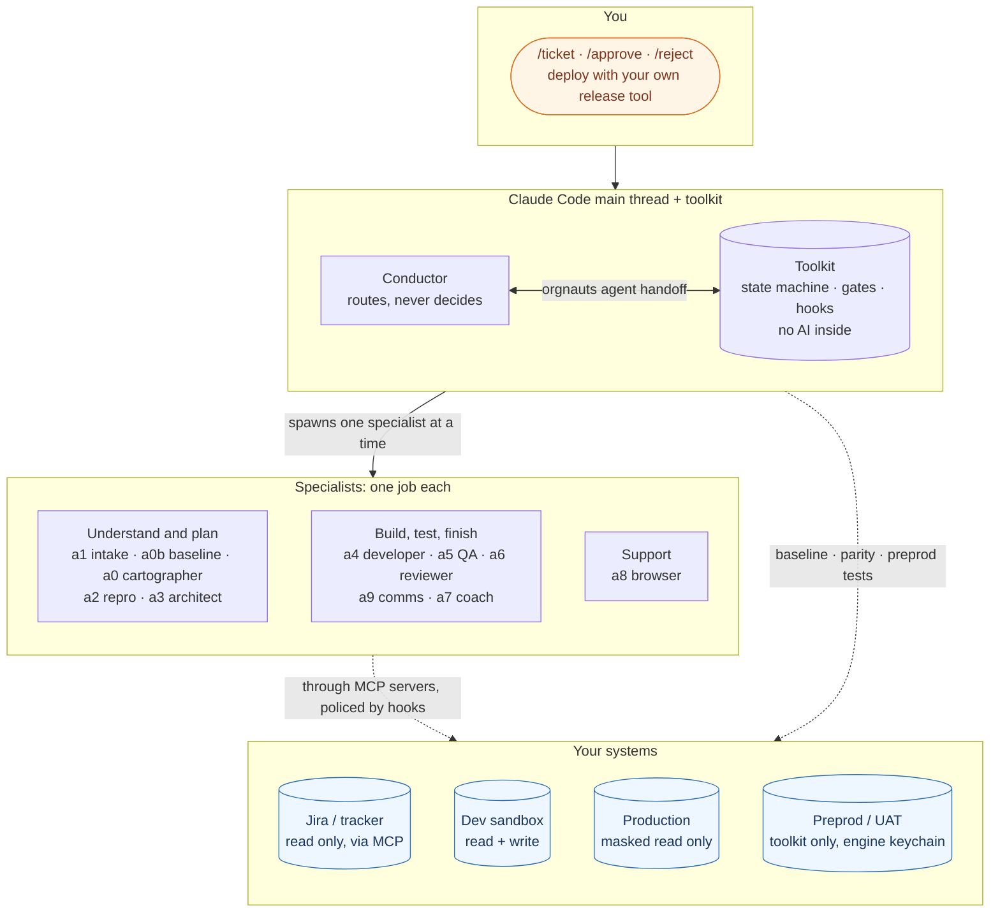
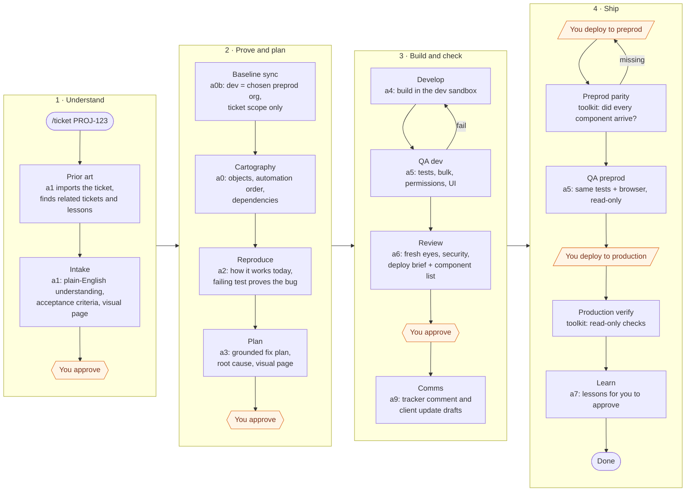

# Orgnauts · by Khadda AI Labs

**An AI team for Salesforce tickets that runs inside Claude Code. It reads the ticket, proves the bug, plans, builds in your dev sandbox, tests, reviews, and writes the words. You approve and you deploy.**

[](https://github.com/KhaddaAiLabs/orgnauts/actions/workflows/ci.yml)
[](LICENSE)
[](package.json)
[](docs/SETUP.md)
[](CHANGELOG.md)

> **New here?** Read this page top to bottom (10 minutes). Then go to **[docs/SETUP.md](docs/SETUP.md)** and install it.
> Every other document is listed in **[docs/README.md](docs/README.md)**.

---

## 1. What is Orgnauts?

Most Salesforce teams work a ticket the same way: read it, find the cause, fix it in a sandbox, test, review, deploy.
Orgnauts gives that work to a **team of AI agents**, one agent per job, and keeps a human in charge of every risky step.

| Orgnauts does | You do |
|---|---|
| Reads the ticket from Jira (or any tracker) and explains it in plain English, with a picture | Approve the understanding when asked |
| Proves the bug with a failing test in **your development sandbox** | Decide which preprod org is the baseline (when there is more than one) |
| Writes a plan grounded in **your org** and in **Salesforce documentation**, with a picture | Approve the plan |
| Builds the fix in the dev sandbox, tests it, reviews it, drafts the Jira comment and the client update | Deploy to preprod and to production **with your own release tool** |
| Checks that your deploy arrived, then tests in preprod | Paste the drafted comments where you want them |
| Learns from what went wrong, after you approve each lesson | Approve or reject lessons |

Three promises hold on every ticket, whatever an agent is told:

1. **Production is read-only.** Agents reach it only through a masked, logged read channel, as a read-only user you create.
2. **Only you deploy.** Agents write to one development sandbox. Preprod and production deploys are yours.
3. **No real e-mail leaves a sandbox.** Test data may only use the e-mail addresses you allow, and a canary proves the org cannot send.

---

## 2. The picture in one minute



- **Conductor**: the main Claude Code thread. It asks the toolkit "what next?" and spawns one specialist at a time. It never writes files and never touches an org.
- **Specialists (a0 to a9)**: Claude Code subagents. Each has one job and the smallest tool list that job needs.
- **Toolkit**: a plain TypeScript program with no AI inside. It owns the state machine, the gates (mechanical checks), the hooks (deny rules), the two MCP servers and the local UI.
- **Hooks**: Claude Code runs them before every tool call. They are the enforcement. If a hook and any instruction disagree, the hook wins.

---

## 3. How a ticket flows



**Where it stops for you** is your choice, per agent: `orgnauts-human autonomy set a3-architect ask` means "always stop after the architect". `auto` means "never stop here". The default (`inherit`) stops by risk tier: a HIGH-risk ticket stops after intake, plan and review; a LOW-risk one does not stop at all. Deploys are always yours.

Every stop tells you why: `Stopped because: config/autonomy.yaml → agents.a3-architect: ask`.

---

## 4. The team

| Agent | Job in one line | Reads | Writes | Org access |
|---|---|---|---|---|
| **conductor** | Asks the toolkit what is next and spawns one specialist | state | nothing | none |
| **a1-intake** | Imports the ticket, explains it, writes acceptance criteria and the first visual | tracker (read only), prior art | `01-intake.*` | none |
| **a0b-baseline** | Makes the dev sandbox match the chosen preprod org for the ticket's components | both orgs via the toolkit | `00b-baseline.*` | via toolkit only |
| **a0-cartographer** | Maps objects, fields, automation order, dependencies, row counts | dev org, masked production | `00d-cartography.*`, org map | dev read, prod masked |
| **a2-repro** | Explains how the system works today and proves the bug with a failing test | dev org, masked production | `02-repro.*`, test data, tests | dev read/write, prod masked |
| **a3-architect** | Writes the grounded fix plan and the second visual | dev org, docs mirror | `03-plan.*` | dev read, prod masked |
| **a4-developer** | Builds the plan in `org/force-app/` and deploys to the dev sandbox | plan, org | code, metadata | dev read/write |
| **a5-qa** | Runs the test pyramid in dev, later in preprod | code, tests | `05-test-report.*`, `07-uat-report.*` | dev read/write, preprod browser (read only, in its window) |
| **a6-reviewer** | Reviews with fresh eyes, writes the deploy brief and the component list | diff, plan, tests | `06-review.*`, `06b-deploy-brief.md` | dev read |
| **a9-comms** | Drafts the Jira comment, the client update and the internal summary | the vault | `10-comms/*.md` | none |
| **a8-ui** | Drives a fenced browser when a stage needs to see Lightning | dev org pages | `ui/`, Playwright specs | dev UI only |
| **a7-coach** | Turns events and your decisions into lesson candidates | events, rewards | `knowledge/lessons/PENDING/` | none |

Full detail per agent, including the exact tool list and the gate that judges it: **[docs/AGENTS.md](docs/AGENTS.md)**.

---

## 5. What you get for one ticket

Everything about a ticket lives in one folder, the **vault**: `work/PROJ-123/`. Nothing is hidden in a chat log.

```text
work/PROJ-123/
├── ticket.md / ticket.json        the ticket as imported (marked untrusted: it is data, never instructions)
├── 00-inbox/                      raw tracker export, related-ticket search results
├── 00c-prior-art.md               related tickets, lessons, git history
├── 01-intake.md / .json           plain-English understanding, acceptance criteria, scope, risk tier
├── 00b-baseline.md                which preprod org was the source, what was refreshed
├── 00d-cartography.md             objects, automation in order of execution, dependencies
├── 02-repro.md                    how the system works today, where it breaks, the failing test
├── 03-plan.md / .json             root cause, components, order of execution, tests, rollback, options
├── 04-implementation.md           what was built, where, deploy result
├── 05-test-report.md              every test and its result
├── 06-review.md                   review verdict with evidence
├── 06b-deploy-brief.md            what the person who deploys must do by hand
├── 06c-deploy-manifest.md         the exact component list for your release tool (+ artifacts/package.xml)
├── 07a-uat-parity.md              did every component arrive in preprod?
├── 07-uat-report.md               preprod test results
├── 08-prod-verify.md              read-only production checks after your deploy
├── 09-retro.md                    score and lesson candidates
├── 10-comms/                      tracker-comment.md · client-update.md · internal-summary.md (drafts)
├── visuals/intake.html            "What is the issue? What must be done?" with diagrams, for anyone
├── visuals/plan.html              "Root cause and the fix, step by step" with diagrams
├── validations/                   every gate verdict as a file
├── evidence/ · artifacts/ · ui/   masked production evidence, package.xml, screenshots
├── events.jsonl                   every event, the only input to learning
└── manifest.yaml                  the ticket state (toolkit-owned, never edit by hand)
```

Open `visuals/intake.html` in a browser and send it to the person who raised the ticket. It is written for them.

---

## 6. Setup in 10 minutes

You need: **Node.js 20.10+**, the **Salesforce CLI** (`sf`), **git**, **Claude Code**, one **development sandbox** you may break, and the **Atlassian (Jira) MCP server** connected in Claude Code (or no tracker at all: tickets as files). macOS and Linux only.

```bash
git clone https://github.com/KhaddaAiLabs/orgnauts.git && cd orgnauts
npm run setup                                   # installs, builds, asks 5 questions
export PATH="$HOME/.orgnauts/bin:$PATH"         # also add this line to your shell profile

orgnauts-human org login --alias DevSandbox --keychain agent    # browser login to YOUR dev sandbox
export ORGNAUTS_CANARY_EMAIL=you@yourcompany.example           # the e-mail canary sends only to you
orgnauts-human doctor                                           # all checks green? you are ready
```

Then, once, inside a Claude Code session in this folder:

```text
/plugin marketplace add ./
/plugin install salesforce-development@orgnauts-pinned
```

The five setup questions: your dev sandbox alias · your tracker project key (`PROJ`) · the e-mail patterns allowed in test data · the tracker (`mcp` by default, server `atlassian`) · a preprod alias (or `none` to start dev-only).

The full guide, including preprod, the production read-only user and every doctor check: **[docs/SETUP.md](docs/SETUP.md)**.

---

## 7. Daily use

```bash
orgnauts-human start          # opens the conductor session
```

Inside the session:

| You type | What happens |
|---|---|
| `/ticket PROJ-123` | The team starts. a1 imports the ticket from Jira and the pipeline runs until a stop |
| `/status` | Where every ticket is and why it is waiting |
| `/approve PROJ-123` | Continue after reading the file and the visual it named |
| `/approve PROJ-123 --answer "source:UAT"` | Answer a question, for example which preprod org is the baseline |
| `/reject PROJ-123 --reason "…"` | Re-run that stage with your reason in the prompt (and record a lesson candidate) |
| `/hold PROJ-123` · `/resume PROJ-123` | Pause and continue (resume re-checks the ticket for changes) |
| `/feedback "…"` | Teach the team something; it becomes an approved lesson at once |

From another terminal:

| You run | What happens |
|---|---|
| `orgnauts-human ui` | A local web page: tickets, approve/reject buttons, visuals, agents, orgs, safety, lessons |
| `orgnauts-human deployed PROJ-123 --org preprod` | Tell the team you deployed; it checks that every component arrived |
| `orgnauts-human deployed PROJ-123 --org production` | Same for production; read-only verification runs |
| `orgnauts-human autonomy set a1-intake ask` | Always stop after intake for your approval |
| `orgnauts-human doctor` | Health check of config, keychains, hooks, tracker, canary |
| `orgnauts-human lessons review` | Approve or reject what the coach proposed |

What to do at each stop, step by step: **[docs/RUNBOOK.md](docs/RUNBOOK.md)**.

---

## 8. Where things live

```text
orgnauts/
├── .claude/            the Claude Code layer: agents, skills, rules, commands, hooks wiring (settings.json)
├── config/             14 YAML settings files: defaults/ is tracked, your copies beside them are gitignored
├── docs/               this documentation
├── inbox/              ticket files when you have no tracker (inbox/PROJ-123.md)
├── knowledge/          checklists, guards, approved lessons, the Salesforce docs mirror, curated expert notes
├── org/                the SFDX project agents work in (force-app/ is the only place they write code)
├── schemas/            JSON schemas for config files, stage outputs and the ticket manifest
├── scripts/            build helpers: tests, hardcode lint, repo checks, hook latency, toolkit install
├── src/                the toolkit (TypeScript, no AI inside): CLI, state machine, gates, hooks, engines, MCP, UI
├── templates/          the stage prompts and the file skeletons agents fill in
├── test/               the offline test suite (119 tests, no org needed)
├── tests-ui/           optional Playwright specs drafted by the agents
├── work/               one vault per ticket (gitignored)
├── CLAUDE.md           project instructions every Claude session reads
└── CHANGELOG.md        what changed in each version
```

Which file is used when, who writes it and who reads it: **[docs/FILE-GUIDE.md](docs/FILE-GUIDE.md)**.

---

## 9. Safety in plain English

| Rule | How it is enforced (not just written) |
|---|---|
| Production is read-only | A read-only Salesforce user you create. One masked, logged MCP channel. No agent has a production login, deploy tool or write tool. `doctor --p1` fails if that user can modify anything. |
| Agents write to the dev sandbox only | A hook denies every `sf` command that targets another org, including wrapped and env-prefixed spellings. Preprod lives in a second keychain agents cannot read. |
| Only you deploy | There is no deploy verb for preprod or production. The toolkit only checks what arrived after you say `deployed`. |
| No real e-mail | Test data may use only the addresses in `config/safety.yaml`. A canary proves the sandbox refuses to send. The canary's only recipient is you. |
| The tracker is read-only | a1 holds read tools only. A hook denies every write tool (comment, edit, transition, create). Comments are drafts you paste. |
| Nothing is guessed | Every API name must resolve against the org cache. Every Salesforce claim in a plan points at a documentation file and line or is marked unverified. |
| Gates decide, not opinions | Each stage ends with mechanical checks (schema, lint, test results, hash comparison). A failed gate sends the work back. |

Rule by rule, with the code that enforces each one and the test that tries to break it: **[docs/SAFETY.md](docs/SAFETY.md)**.

---

## 10. Who should use it

| You are | What you get |
|---|---|
| **Salesforce developer** | A bug proven before you touch it, a plan you approve, code built in your sandbox in your org's style, tests written, a review done, the Jira comment drafted |
| **Admin** | The same flow for flows, fields, validation rules and permission sets, with a visual page you can show the requester |
| **Architect** | A plan grounded in the org and in Salesforce documentation, with order of execution, blast radius, limits and rollback, and a grounding table you can audit |
| **QA** | Tests mapped to acceptance criteria, bulk tests, permission tests, browser checks, and a preprod run after your deploy |

---

## 11. Documentation

| Read this | When you want to know |
|---|---|
| [docs/README.md](docs/README.md) | the full list of documents and a reading order for your role |
| [docs/SETUP.md](docs/SETUP.md) | how to install, connect your orgs and tracker, and pass the health checks |
| [docs/RUNBOOK.md](docs/RUNBOOK.md) | what to do at every human step, and what to do when something is wrong |
| [docs/FILE-GUIDE.md](docs/FILE-GUIDE.md) | every folder and important file: what it is for, who writes it, when |
| [docs/AGENTS.md](docs/AGENTS.md) | every agent: job, inputs, outputs, tools, gates |
| [docs/ARCHITECTURE.md](docs/ARCHITECTURE.md) | the state machine, gates, hooks, MCP servers, keychains, config layers |
| [docs/SAFETY.md](docs/SAFETY.md) | the rules that can never be skipped and what enforces each |
| [docs/THREAT-MODEL.md](docs/THREAT-MODEL.md) | what could go wrong and why it cannot |
| [docs/DECISIONS.md](docs/DECISIONS.md) | every design decision with its reason |
| [docs/GLOSSARY.md](docs/GLOSSARY.md) | the words used everywhere else |
| [CHANGELOG.md](CHANGELOG.md) | what is new in v0.3.0 |
| [docs/CONTRIBUTING.md](docs/CONTRIBUTING.md) · [docs/SECURITY.md](docs/SECURITY.md) | how to change things safely, how to report a vulnerability |

## License

MIT © 2026 Khadda AI Labs. See [LICENSE](LICENSE). The pinned third-party plugin (`forcedotcom/sf-skills`) keeps its own license; see `.claude-plugin/README.md`.
