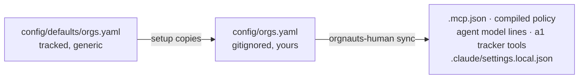

# config/ — the settings

Everything a team would change lives here, as YAML. Each file has a JSON schema in `schemas/config/`; the toolkit refuses a file that does not validate (doctor check 1).

## Two layers, one file name

| Path | In git? | Who writes it |
|---|---|---|
| `config/defaults/<name>.yaml` | **yes**, ships with the repository, must stay generic (`npm run lint:hardcode` scans it) | maintainers |
| `config/<name>.yaml` | **no** (`.gitignore` has `config/*.yaml`) | you: `orgnauts-human setup`, `orgnauts-human org add`, `orgnauts-human autonomy set`, the UI |

The toolkit reads **your copy when it exists, the default otherwise**, file by file. A fresh clone runs with the defaults; the first `setup` creates your copies; `git status` never shows them. Tests always start from `config/defaults/`.

After **any** change here, or any `sf org login/logout`: `orgnauts-human sync`.

## The files

| File | What it controls | How you usually change it |
|---|---|---|
| `orgs.yaml` | your orgs: `alias`, `role` (`development` · `preprod` · `evidence`), `keychain`, `label`, `baseline_source` | setup wizard, `orgnauts-human org add`, UI → Orgs |
| `tracker.yaml` | how tickets are read: `adapter: mcp` (default) with `mcp.server` / `mcp.kind` / `mcp.read_tools`, or `jira`, or `file`; `project_key` | setup wizard, then `sync` |
| `autonomy.yaml` | where the system stops: the risk-tier matrix and the per-agent switch `agents.<agent>: ask / auto / inherit` | `orgnauts-human autonomy set <agent> ask`, UI → Agents |
| `safety.yaml` | allowed test e-mail patterns, containment mode (`blocked` / `allowlist_only`), canary rules, test-tag field, browser deny rules | UI → Safety |
| `policy.yaml` | what the Bash policy hook denies; `allowed_deploy_targets`; baseline sync policy | by hand, then `sync` |
| `models.yaml` | model and reasoning effort per agent | UI → Agents, then `sync` |
| `budgets.yaml` | per-ticket token / USD / minute limits; model prices used for cost | by hand |
| `masking.yaml` | which production objects and fields the evidence server may return | by hand, with whoever owns data privacy |
| `naming.yaml` | the patterns the `naming-lint` gate enforces | `orgnauts-human conventions build`, by hand |
| `rewards.yaml` | points per event for the reward ledger | by hand |
| `learning.yaml` | how lessons are proposed and promoted | by hand |
| `notify.yaml` | optional Slack webhook (the URL lives in an env var) | by hand |
| `calendar.yaml` | release freeze windows the deploy brief respects | by hand |
| `approvers.yaml` | who may approve which stage (informational) | by hand |
| `people/<name>.md` | recipient profiles for the comms drafts | by hand (see `people/README.md`) |

## Three settings worth knowing (v0.3.0)

**`tracker.yaml → adapter: mcp` (D-105).** The a1-intake agent reads the ticket through the tracker's own Claude Code MCP server. The toolkit stores no API token and no base URL. `mcp.server` is the MCP server name (`atlassian` by default; tools are `mcp__<server>__<tool>`), `mcp.kind` names the tracker for prompts (`jira | linear | github | azure-devops | other`), and `mcp.read_tools` is the **only** list of tracker tools the agent may call. `sync` writes them into `.claude/agents/a1-intake.md`; the `tracker-guard` hook denies everything else, write tools above all. Any tracker with an MCP server works: set the three keys and sync. No tracker: drop `inbox/<KEY>.md`. `post_draft: disabled` cannot be enabled.

**`autonomy.yaml → agents.<agent>: ask | auto | inherit` (D-106).** `ask` stops after that agent for your `/approve`, whatever the tier. `auto` never stops there. `inherit` follows the `tiers` matrix. Deploys and remediation always stop (`hard_floor`, enforced in code). Every stop says "Stopped because: …".

**`orgs.yaml` with several `role: preprod` orgs (D-108).** Give each a `label` and mark one `baseline_source: true`. The baseline stage uses the default, or stops and asks when there is none: `/approve <KEY> --stage baseline --answer "source:<alias>"`.

## Machine-specific permission rules

`.claude/settings.json` (tracked) carries the static deny rules. `.claude/settings.local.json` (gitignored, written by `sync`) carries the deny rules for *your* preprod and evidence aliases and for every other org in your sf keychain.

## Secrets

Never here. `ORGNAUTS_JIRA_TOKEN`, `ORGNAUTS_SLACK_WEBHOOK`, `ORGNAUTS_CANARY_EMAIL`, `ANTHROPIC_API_KEY` are environment variables. `npm run lint:hardcode` fails if a config file looks like it holds a token.
