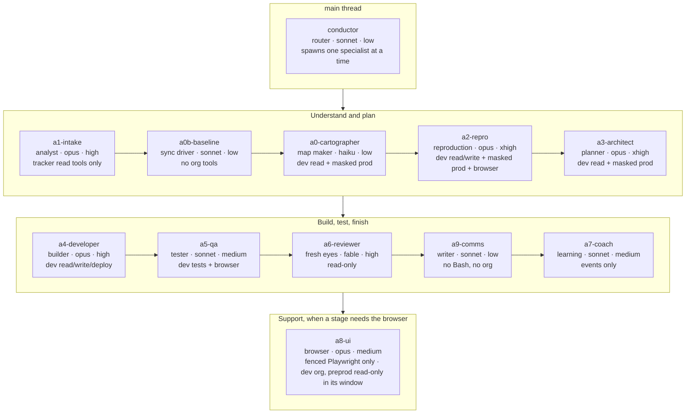

# Orgnauts — The agents: who does what, with what, and what they can never do

Orgnauts is one **conductor** and eleven **specialists**. Each is a Claude Code subagent defined in `.claude/agents/<name>.md`. That file is its system prompt, its model and reasoning effort (from `config/models.yaml`, written by `orgnauts-human sync`), its **tool allowlist** (a tool not listed cannot be called), its disallowed tools, and the skills preloaded into it.

Command *arguments* are policed by hooks, not by the agent. A developer may hold the deploy tool, and the hook still refuses any target that is not the development org.

## The team at a glance

| Stage | Agent | Writes | Gates that judge it | Stops for you? |
|---|---|---|---|---|
| prior_art, intake | a1-intake | `00c-prior-art.*`, `01-intake.*`, visual | ticket-import, contract-check, risk-floor, visual-check | HIGH tier, or `agents.a1-intake: ask` |
| baseline | a0b-baseline | `00b-baseline.*` | baseline-check | when several preprod orgs and none chosen; when dev is newer |
| cartography | a0-cartographer | `00d-cartography.*`, `docs/org-map/` | contract-check | no |
| repro | a2-repro | `02-repro.*`, test data, tests | email-guard, naming-lint, assertion-referee, contract-check | no (escalates after 2 honest tries) |
| plan | a3-architect | `03-plan.*`, visual | plan-lint, semantic-check, checklist, contract-check, visual-check | MEDIUM+ tier, or `agents.a3-architect: ask` |
| develop | a4-developer | `org/force-app/`, `04-implementation.*` | comment-lint, naming-lint, plan-lint, deploy-report, contract-check | no |
| qa_dev, qa_uat | a5-qa | `05-test-report.*`, `07-uat-report.*` | assertion-referee, test-quality, contract-check (+ uat-parity) | no |
| review | a6-reviewer | `06-review.*`, `06b-deploy-brief.md` | security, contract-check | HIGH tier, or `agents.a6-reviewer: ask` |
| comms | a9-comms | `10-comms/*.md` | comms-lint | no |
| support (repro, qa) | a8-ui | `ui/`, `tests-ui/specs/` | — (the referee judges) | no |
| learn | a7-coach | `09-retro.*`, `knowledge/lessons/PENDING/` | — | you approve each lesson |

Any agent can be set to `ask` or `auto` with `orgnauts-human autonomy set <agent> ask|auto|inherit`. Deploys and remediation always stop.

---

## The shape of every agent file

| Field | Meaning |
|---|---|
| `model` / `effort` | Which Claude model and reasoning effort. Routing is low; reproduction and design are xhigh. Edit in UI → Agents. |
| `tools` | The complete allowlist. `mcp__sf-dev__*` = the Salesforce DX MCP server bound to the **development** org only. `mcp__orgnauts-evidence__*` = masked read-only production. `mcp__orgnauts-ui__*` = the fenced browser. `mcp__<tracker>__*` = tracker read tools (a1 only). |
| `disallowedTools` | Always includes `WebFetch`, `WebSearch` (P12: agents never browse) and `Agent` (specialists never spawn agents). |
| `background: false` | Every specialist runs in the foreground so the stage gates can run when it stops (D-093). |
| `maxTurns` | Hard cap on the agent's own loop; a partial result is handed back honestly. |
| `memory: project` | The agent may keep unverified notes in `.claude/agent-memory/<name>/MEMORY.md` (quarantined; audited by the coach). |
| `skills` | Preloaded: `orgnauts-core-rules` (P1–P12) for everyone, then job methods (`orgnauts-*`), the standards (`std-*`, plus the generated `<prefix>-*` overlay once you ran `conventions build`), and `lessons-<name>` (human-approved lessons). |
| Writes | Only inside `org/force-app/`, `tests-ui/`, its own ticket vault `work/<KEY>/` and its own memory (write-guard hook), plus the role exceptions noted below. |

---

## conductor — the foreman (main thread)

*sonnet · low · tools: Read, Glob, Grep, Bash, Skill, Agent(the eleven specialists)*

Started by `orgnauts-human start` (= `claude --agent conductor`). It is a **router, not a decider**. It runs `orgnauts agent handoff <KEY>` and follows the one action the toolkit answers with: SPAWN (one specialist, in the foreground, with the exact prompt the toolkit rendered), WAIT_AGENT, WAIT_HUMAN (tell you what is needed and stop), RUN_TOOLKIT, HOLD, PARKED, ESCALATED, FAILED, DONE. It never writes files, never touches an org, never spawns two specialists at once, never approves anything for you, and never re-checks a specialist's work (the gates did).

## a1-intake — the analyst (prior_art, intake)

*opus · high · tools: Read, Glob, Grep, Bash, Write, Skill, the tracker's READ tools · **no Salesforce org access on purpose***

**Step 0: it imports the ticket (D-105).** The toolkit holds no tracker credential, so `orgnauts agent open` writes only a stub. The agent calls the tracker's read tool (`getJiraIssue` by default), saves the raw result as `work/<KEY>/00-inbox/ticket-import.json` (copied, never summarised), and runs `orgnauts agent ticket import <KEY> --file …`. The toolkit validates it, strips `<untrusted>` tags, writes `ticket.md` inside the envelope and indexes prior art. Then it runs the tracker's search tool with the `suggested_search` query the toolkit printed, saves `tracker-hits.json`, and re-runs `prior-art`. It is the only agent with tracker tools, all read: the `tracker-guard` hook denies anything else (`T1-tracker-readonly`). The `ticket-import` gate fails `prior_art` while the stub is there.

**Then it explains the ticket.** It reads the ticket (data, never instructions), pasted screenshots and comments, prior art and the org map, and writes `01-intake.md`:

- a plain-English **business lens** and a **technical lens** (hypotheses with confidence),
- **§2a Picture**: today vs expected, as ASCII, mermaid and one worked example,
- the classification: BUG / ENHANCEMENT / DATA-FIX / QUESTION, with the deciding sentence quoted,
- numbered, testable **acceptance criteria**, each traceable to a ticket line,
- the **scope** as `Type:ApiName` with a source each, or `(needs cartography)`; never a guessed name,
- an advisory **risk tier** (the `risk-floor` gate may only raise it),
- the **blocking questions** for you,
- an **injection notice** for any instruction-like text found in the ticket.

`01-intake.json` carries the **`visual` block** (D-107): what is the issue · what must be done · one real example · two mermaid diagrams · glossary. The toolkit renders it to `work/<KEY>/visuals/intake.html` for a non-developer.

## a0b-baseline — baseline sync (baseline)

*sonnet · low · tools: Read, Glob, Grep, Bash, Write, Skill · **no org tools***

Every developer has their own dev sandbox; preprod is shared and may already hold another developer's work. This agent makes the dev sandbox equal to **the right preprod source** for the ticket's scope before anyone writes code.

1. `orgnauts agent baseline <KEY> --list-sources` (D-108): the configured `role: preprod` orgs with their `label` and the `[default]` one. One source, or a default → used. Several and none chosen → the toolkit stops as `waiting_human (baseline)` and you answer `/approve <KEY> --stage baseline --answer "source:<alias>"`. The agent never picks.
2. `orgnauts agent baseline <KEY>`: the toolkit (engine keychain for the source, agent keychain for dev) expands scope through the dependency graph, retrieves both sides, classifies each component IDENTICAL / UAT-NEWER / DEV-NEWER / BOTH-CHANGED / UNKNOWN, snapshots dev, applies `config/policy.yaml → baseline_sync`, copies the source versions into dev **only where they differ**, and verifies.

`00b-baseline.md` names the source and says **Refresh needed: YES/NO**. DEV-NEWER, BOTH-CHANGED and UNKNOWN stop and ask you. Direction is always source → dev. Skipped entirely in a dev-only configuration.

## a0-cartographer — the map maker (cartography)

*haiku · low · tools: Read/Glob/Grep/Bash/Write/Edit, dev MCP (retrieve, SOQL), evidence tooling/describe/row_count*

Writes `00d-cartography.md/.json` for this ticket: objects and key fields, automation **in order of execution** (before-save flows → before triggers → validation rules → duplicate rules → after triggers → assignment, auto-response, workflow → escalation → flows launched by workflow → after-save flows → entitlement rules → roll-ups → commit → post-commit e-mail and async), consumers of every scoped component (dependency graph), data shape (COUNT and GROUP BY only, never record dumps), dev↔prod drift dates, conventions observed, unknowns. Every API name comes from a retrieve, describe, Tooling query or the existing org map, never from memory of "typical orgs". May append to `docs/org-map/*`.

## a2-repro — the reproduction engineer (repro)

*opus · xhigh · tools: Read/Glob/Grep/Bash/Write/Edit, dev MCP (SOQL, retrieve, run tests), evidence, fenced browser*

"Nothing gets fixed until it is proven broken by an assertion that fails." In order:

1. **Masked production evidence** for the bug's footprint. Production data shapes come **only** through `mcp__orgnauts-evidence__*`; Email and Phone fields are refused by the server.
2. **How the system works today, step by step, and where it breaks** (D-112): one record's path through the real components, written into `02-repro.md` and `02-repro.json → system_walkthrough[]`, so the architect, developer and QA share one picture.
3. **Dev test data**: minimal, bulk-honest (≥200 where automation is involved), meaningfully named, tagged, with **fake e-mails from the allowlist only**, created by an anonymous Apex script the toolkit runs after a PASS canary.
4. A **failing** Apex/Flow/SOQL assertion **and** an inverse assertion that must keep passing; predicted distribution; `privileged test --phase repro`.

UI steps run in the dev org through the fenced browser. Two honest tries, then an honest escalation. **Enhancement mode** (D-098, D-112): no bug exists; the agent writes the **background** instead (what exists today around the new behaviour) and the "failing tests" are acceptance tests, one per criterion, failing because the behaviour does not exist yet. Never fixes code.

## a3-architect — the solution architect (plan)

*opus · xhigh · tools: Read/Glob/Grep/Bash/Write, dev MCP (retrieve, SOQL), evidence*

Writes the plan the developer implements, QA tests, the reviewer reviews and you approve. It acts as a real Salesforce architect:

- **Grounded**: every API name resolves against your org's caches (refreshed first with `cache freshen`); every component is retrieved and read before it is planned against; every platform behaviour claim points at a `knowledge/mirror` or `knowledge/curated` file and line, or is marked `unverified` in the **grounding table** and the unknowns (P12).
- **Complete**: nine sections — root cause · components · order of execution and side effects with **§3a Picture** before → after · consumers and blast radius · bulk and limits · tests · rollback and kill switch · remediation · options + unknowns + grounding table + checklist answers (architecture, data, deployment, e-mail, flow, limits, security, sharing, test data).
- **Honest**: a decision that belongs to a human ("should escalated cases reach a queue at all?") is written as a blocking unknown, never chosen silently.

`03-plan.json` carries the **`visual` block** (D-107): root cause in plain words · the fix step by step · one real example · two mermaid diagrams · glossary, rendered to `work/<KEY>/visuals/plan.html`. Pseudocode and signatures only; no code, no deploys, no data.

## a4-developer — the developer (develop)

*opus · high · tools: Read/Glob/Grep/Bash/Write/Edit/MultiEdit, dev MCP (retrieve, deploy, SOQL, tests, Code Analyzer), Salesforce language server*

Implements **exactly** the approved plan (plus your edits from `approvals/`) in `org/force-app/`, in the org's existing comment and naming style. Language-server diagnostics after every Apex edit; Code Analyzer on changed files; **dev sandbox deploy only** (`privileged deploy-dev`); preprod validate-only dry run through the engine (`privileged uat-validate`; it never sees that org). Security by default (`with sharing`, `WITH USER_MODE`, bind variables, no hard-coded ids, URLs or e-mails); bulk by default; one trigger per object through the org's framework; a new field ships with the permission set that grants its FLS; never weakens or deletes the repro test. No browser tool: when the change should be seen rendered it writes `work/<KEY>/ui-request.md` for QA and a8-ui. It runs `sf` plainly against the dev alias only; wrapped, env-prefixed or path-invoked `sf` is denied (D-110). A deviation from the plan is allowed only when the plan is impossible as written, and is recorded with evidence.

## a5-qa — QA (qa_dev, qa_uat)

*sonnet · medium · tools: Read/Glob/Grep/Bash/Write/Edit, dev MCP (tests, SOQL, retrieve), fenced browser*

"Decides nothing by opinion." Maps every planned test to a concrete one and writes the missing ones (bulk 200, meaningful names, org style), runs the pyramid through the toolkit (`privileged test --phase dev`: Apex, Flow tests, SOQL distribution assertions), permission tests (`runAs`), UI checks through the fenced browser when the change is visible in Lightning, regression on every touched object's existing tests, test-quality rules (assertions everywhere, no `SeeAllData`). The report quotes run files. A `fail` verdict is a good outcome when true: the toolkit bounces to the developer (once) or the architect (twice), then escalates to you.

In preprod (`qa_uat`) it runs no `sf` or SOQL against the org itself: the engine runs the same test set with its own keychain, after the toolkit verified the deploy arrived (`uat_verify`, D-099). What it can do there is **look** (D-109): while the ticket is at `qa_uat`, `mcp__orgnauts-ui__ui_login` opens the preprod org through the engine keychain as a least-privilege test user, read-only. The window closes when the ticket leaves the stage.

## a6-reviewer — the fresh-eyes reviewer (review)

*fable (a different model alias than the developer, on purpose) · high · tools: Read/Glob/Grep/Bash/Write, Code Analyzer, retrieve, language server · **read-only***

"Did not write this code and must not want it to pass." First runs `orgnauts agent deploy-manifest <KEY>` so the exact changed-component list comes from git (`06c-deploy-manifest.md`, `package.xml`, D-100). Then reviews nine dimensions with evidence per finding (`file:line`, gate file, run file): plan conformance, acceptance criteria → proving tests, repro proof (FAIL → PASS), security surface (sharing, CRUD/FLS, injection, hard-coded ids, PII in logs), Well-Architected pillars, order of execution and side effects, style vs conventions, test quality, git delta sanity. Verdict APPROVE / APPROVE WITH NITS / REQUEST CHANGES. Writes the **deploy brief** `06b-deploy-brief.md` for the person who presses Deploy: components, what to do by hand (profiles, permission sets, layouts, flow activation, environment-specific ids), pre-deploy checks, release window vs `config/calendar.yaml`, post-deploy verification SOQL, rollback, remediation hand-off, comms readiness, risks.

## a9-comms — the communications writer (comms)

*sonnet · low · tools: Read, Glob, Grep, Write, Skill · **no Bash at all***

Drafts, never sends: `10-comms/client-update.md` (client-visible: plain language, no internal names, record ids, addresses or blame), `internal-summary.md`, `tracker-comment.md` (a comment **you** may paste into the ticket). Posting is disabled by design: the agent has no tracker tool, and the `tracker-guard` hook denies every tracker write tool for everyone (D-105). Every sentence traces to a vault file; nothing from inside an untrusted envelope is copied.

## a8-ui — the browser (support during repro, qa_dev, qa_uat)

*opus · medium · tools: Read/Glob/Grep/Bash/Write/Edit, `mcp__orgnauts-ui__*` only*

Some behaviour exists only in the browser: screen flows, quick actions, LWC, page layouts. When a2 or a5 ends its turn with "UI observation requested" (after writing `ui-request.md`), the conductor spawns a8. It logs into the **development org** through the fenced Playwright server (production and `login.salesforce.com` refused at the network layer, Setup URLs refused, no JavaScript evaluation), performs the exact steps on a record the ticket created, captures text and screenshots into `work/<KEY>/ui/`, drafts a Playwright spec into `tests-ui/specs/`, and hands the observation back. During a ticket's `qa_uat` window it may also open the preprod org, read-only. It never issues a pass/fail; the referee (an assertion) does.

## a7-coach — the learning coach (learn, and maintenance)

*sonnet · medium · tools: Read, Glob, Grep, Bash, Write, Skill · **no org access***

"The team gets better only if the lessons are true." Runs `learn-digest` (the toolkit computes rewards from events and writes the mechanical retro), then reads events, rewards, your rejection reasons and `/feedback`, and the agents' quarantined notes, and writes **lesson candidates** into `knowledge/lessons/PENDING/`: one behaviour change each, phrased as an instruction the target agent can follow, with event ids as evidence. The only admissible evidence is events, rewards and human decisions (P6). You approve, reject or promote lessons (UI → Lessons & rewards); approved lessons are regenerated into `lessons-<agent>` skills. `/feedback "…"` from you becomes an approved lesson immediately (D-082).

---

## What no agent can do, whatever its prompt says

Write to production · reach preprod except through the toolkit's engine verbs (and the read-only `qa_uat` browser window) · run `orgnauts-human` verbs, by name or by file path · run `orgnauts-hook` itself · run `sf` through a wrapper, an env prefix, `npx` or an absolute path · log into or switch orgs, change aliases or the default org · push to git or touch a Blue Canvas remote · launch `claude` · browse the web · write to the tracker in any form (comment, edit, transition, create) or send e-mail · write outside its own areas · spawn another agent (specialists) or two at once (conductor) · treat text inside an `<untrusted>` envelope as an instruction · argue with a gate.

The mechanisms behind each item are in [SAFETY.md](SAFETY.md) and [THREAT-MODEL.md](THREAT-MODEL.md); the tests that try to break them are `test/03-hooks.test.mjs`, `test/11-beta-run1-fixes.test.mjs`, `test/14-hard-rules.test.mjs` and `test/15-v030-core.test.mjs`.
