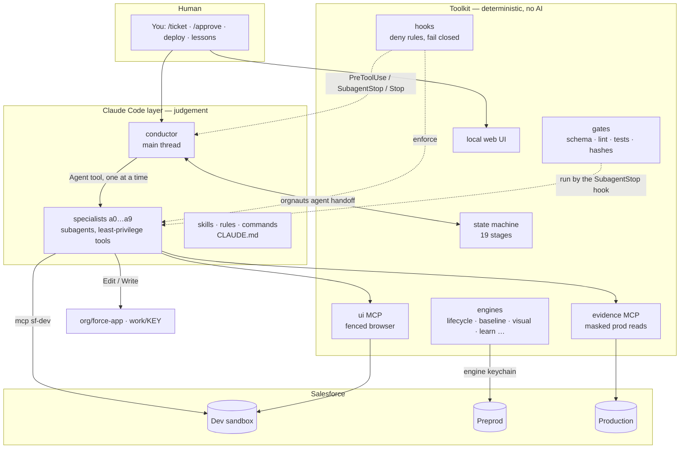

# Orgnauts — Architecture

This page is for the person who wants to know how it works inside. If you only want to use it, read [RUNBOOK.md](RUNBOOK.md). If you want to know what every file is for, read [FILE-GUIDE.md](FILE-GUIDE.md).

## 0. The whole thing in one picture



## 1. Three parts, three responsibilities

| Part | Decides | Never decides |
|---|---|---|
| **Claude Code layer** (conductor + 11 specialists, skills, rules, commands, hooks wiring) | *how* a stage's work is done: reading, reasoning, writing files, calling tools | what happens next, whether a stage passed, whether something is safe |
| **Toolkit** (`src/` → `orgnauts`, `orgnauts-human`, `orgnauts-hook`, MCP servers, UI) | state machine, gates, keychains, masking, baseline sync, rewards, approvals bookkeeping | anything that needs judgement about Salesforce |
| **Human** | approvals at gates, deploys, remediation, lesson approval, org/model/budget config | nothing is done *for* the human that they did not ask for |

The conductor runs on the main thread (`claude --agent conductor`) and calls `orgnauts agent handoff <KEY>` in a loop. The toolkit answers with exactly one action (SPAWN / WAIT_AGENT / WAIT_HUMAN / RUN_TOOLKIT / HOLD / ESCALATED / PARKED / FAILED / DONE) and, for SPAWN, the rendered prompt for exactly one subagent. Hooks make everything else impossible. Every Agent call is **foreground**: the stage gates run when the subagent stops, so a background spawn would end the conductor's turn before the stage could be judged; the agent-gate hook denies it (D-093).

### Map of the code

| Folder | Role | Start reading at |
|---|---|---|
| `src/core/` | the facts: stages, manifest, config layers, events, every `sf` call | `state-machine.ts`, `config.ts` |
| `src/cli/` | the two command surfaces | `agent.ts` (agents may run), `human.ts` (only you) |
| `src/hooks/` | the deny rules and the stage gate runner | `fast.ts` (zero dependencies), `heavy.ts` |
| `src/gates/` | the mechanical checks, one function each | `registry.ts` |
| `src/engines/` | the work behind each verb | `lifecycle.ts`, `baseline.ts`, `visual.ts` |
| `src/privileged/` | steps that touch orgs with care (canary, deploy-dev, validate, tests, parity) | `index.ts` |
| `src/mcp/` | the two MCP servers | `evidence-server.ts`, `ui-server.ts` |
| `src/ui/` | the local web UI | `server.ts` |
| `src/doctor/` | the health checks | `index.ts` |

## 2. Stage machine (`src/core/state-machine.ts`)

```
open ─ prior_art(a1) ─ intake(a1)·gate ─ baseline(a0b) ─ cartography(a0) ─ repro(a2) ─ plan(a3)·gate ─ develop(a4)
     ─ qa_dev(a5) ─ review(a6)·gate ─ comms(a9) ─ deploy_uat(HUMAN) ─ uat_verify(toolkit, D-099) ─ qa_uat(a5) ─ deploy_prod(HUMAN)
     ─ prod_verify(toolkit) ─ remediation(HUMAN, optional) ─ learn(a7 coach) ─ done            (19 stages)
```

Every stage has `gates[]` (mechanical, run by the SubagentStop hook), optionally a `human_gate` key, and `always_human` for the
deploy/remediation stages. **Who stops the pipeline (D-106):** `config/autonomy.yaml → agents.<agent>` is read first — `ask`
stops after that agent's stage, `auto` never stops there, `inherit` falls back to the tier matrix
(`tiers.<TIER>.human_gates.<stage>`; a stage without a gate key is automatic). `always_human` stages ignore all of it (hard
floor). The WAIT_HUMAN prompt ends with "(Stopped because: …)" naming the rule that applied, and names
`work/<KEY>/visuals/<stage>.html` when the stage has one. `manifest.yaml` is the single source of truth per ticket (incl. the
flag `ticket_import_pending` while the vault still holds the MCP stub, D-105); a `.state.json` sidecar lets the zero-dependency
hooks and the UI MCP server read status without parsing YAML.

**Bounce ladders** (`bounceTarget`): qa fail → develop (1) → plan (2) → escalate (3); repro: 2 tries then honest escalation;
every other agent stage: one retry with the gate report, then escalate. **Rejection** (`/reject … --reason`) re-runs the
rejected stage with the reason in its prompt (the reason also becomes a lesson candidate). **Support flow**: a specialist
that ends with "UI observation requested" (after writing `ui-request.md`) stops cleanly; the next handoff spawns `a8-ui`,
then re-spawns the specialist on the same attempt — no bounce, no penalty. **Blocks**: a SubagentStop can block the same
agent up to 3 times per attempt; then the stage is marked failed and handoff bounces/escalates.
**A live agent is not a failure** (D-093): the stage-gate stamps `agent_ended_at` on the attempt whenever the subagent
genuinely ends (gates passed, or the block cap reached); while a `running` stage carries no stamp the handoff answers
`WAIT_AGENT`, bounded by `AGENT_WAIT_CAP` (8) and then handed to the normal bounce ladder. `/resume` **recovers** a failed
agent stage by re-running its gates: all passing means the work really was finished, so the stage is marked done without
re-running the agent. **Preprod parity** (D-099): `uat_verify` is a toolkit stage — it retrieves the deploy-manifest components from preprod with the
engine keychain, fingerprints them path-independently and compares with the dev source; MISSING / DIFFERENT / STILL_IN_UAT or a
retrieve that could not run sends the ticket back to `deploy_uat` as `waiting_human (deploy)` with the list (a bounce
`uat_verify → deploy_uat`). A human may accept named differences with a reason (`orgnauts-human parity`), valid for the same source
hash only. **Budget**: over the per-ticket **fresh** tokens (input + output + cache_creation — cache reads are
re-reads of context already paid for and are never counted, D-094) or USD → `parked` (resumable). **Human gates**: `waiting_human` with a typed `waiting.kind`
(approval | deploy | remediation | question | budget | baseline | canary). **Baseline source (D-108)**: with several `role: preprod`
orgs configured and none chosen (`baseline_source: true` marks the default), the baseline stage stops as `waiting_human (baseline)`
until `/approve <KEY> --stage baseline --answer "source:<alias>"` or `orgnauts-human baseline decide <KEY> --source <alias>`;
the sync then compares dev with that source and copies only the differing scope components (source → dev).

## 3. Gates (`src/gates/`)

| Gate | Reads | Passes when |
|---|---|---|
| contract-check | `NN-*.json` vs `schemas/contracts/*.schema.json` | valid schema; evidence refs that look like files exist |
| ticket-import | `ticket.json` (prior_art, D-105) | the vault no longer holds the MCP stub: a1 imported the real ticket (`orgnauts agent ticket import`) and it has a real title |
| visual-check | `01-intake.json` / `03-plan.json → visual` (intake, plan, D-107) | the block is complete (issue · fix · example · two mermaid diagrams that start with a diagram keyword and connect ≥ 2 nodes, no script tags) and renders to `work/<KEY>/visuals/<stage>.html` |
| risk-floor | `01-intake.json` | computes tier floor (Apex/permissions → HIGH; flow/VR → MEDIUM); agent may only raise |
| baseline-check | `00b-baseline.json` | every in-scope component equal to preprod after sync or explicitly excluded |
| email-guard | changed files + artifacts | no address outside `safety.allowed_test_emails` |
| naming-lint | new component/test names, data tags | `config/naming.yaml` patterns; no ticket-number names |
| assertion-referee | `02-repro.json` + `validations/tests-<phase>.json` | repro: failing FAIL + inverse PASS; dev/uat: all PASS + distribution holds |
| plan-lint | `03-plan.json` (or repro/implementation) vs `.orgnauts/cache/{describe,metadata}` | every api_name resolves; new names only with `action: create` |
| semantic-check | plan fields/flows/api_version | writable fields, no managed edits, before-save flow rules, api version consistent with `sfdx-project.json` |
| checklist | plan `checklist_answers` vs `knowledge/checklists/*.yaml` | every applicable item answered (n/a needs a note) |
| comment-lint | changed `.cls/.trigger/*-meta.xml/lwc` | header doc, method docs, mod-log with ticket, `<description>` |
| deploy-report | `validations/deploy-dev.json`, `uat-validate.json` | succeeded, 0 errors, file hashes still current |
| uat-parity | `validations/uat-parity.json` vs the current deploy-manifest files hash | every changed component MATCH (or DELETED_OK / human-ACCEPTED) in preprod; not verified → failed; source changed since → failed; no preprod configured → passed by config (D-099) |
| test-quality | changed test classes + report | assertion in every method, no SeeAllData |
| security | changed Apex + `06-review.json` | ruleset clean; crud_fls + sharing stated |
| comms-lint | `10-comms/*.md` | audience header; no forbidden terms/secrets/envelopes in client drafts |
| analyzer | `validations/analyzer.json` | Code Analyzer findings ≤ threshold |

Outcomes are `passed | failed | unavailable`; **unavailable is never passed**. Every outcome is persisted to
`validations/<stage>-<gate>.json`, recorded in the manifest with an artifact hash, and emitted as an event (with
`first_try` for the reward ledger).

## 4. Hooks (`src/hooks/`, wired in `.claude/settings.json`)

| Event | Hook | Behaviour |
|---|---|---|
| PreToolUse Agent | `agent-gate` (fast, ≤50 ms) | deny agents not in `next_allowed_stages`, denied names, when waiting/on hold/parked/done, **and any background spawn** (`run_in_background` and every other spelling — D-093) |
| PreToolUse Bash | `policy` (fast) | R1 human verbs, by name **and by file path** (`node dist/cli/human.js …`) · R1-hook-direct (agents never run `orgnauts-hook` / `dispatch.js`) · R2 HOME/SF_* / engine home · R2-env-prefix (`VAR=x sf …`, incl. `ORGNAUTS_HOOKS_OFF=1 sf …`) · R2b `sf config set` / `sf alias set` / `sf org login` (re-pointing an alias or the default org) · R3 git push / Blue Canvas · R4 nested claude · R5 direct HTTP to Salesforce · R6 protected paths (write targets only; incl. `node_modules/`, `.claude/settings.local.json`, `.gitignore`, `.forceignore`, `org/sfdx-project.json`, `tests-ui/auth.setup.ts`, `tests-ui/playwright.config.ts`, `package-lock.json`, `tsconfig.json`; absolute paths into the repo are judged like relative ones) · R7 sf targets (any explicit target that is not a configured development alias is denied — reads included, bare usernames included; preprod/prod get specific messages; writes and `sf api request` need an explicit dev target; org login deny) · R7-wrapped-sf (`sf` through `bash -c` / `sh -c` / `eval` / `xargs` / `env` / `node -e` / `python -c` / `npx` / an absolute path / `$(which sf)` — a wrapped command cannot be judged, so it is refused) (D-110) |
| PreToolUse Edit/Write/… | `write-guard` (fast) | write areas only; own ticket vault; own agent memory; role exceptions (a0 → docs/org-map, a7 → lessons/PENDING) |
| PreToolUse mcp__sf-dev__.* | `data-guard` (fast) | side-effect tools need a fresh PASS email canary |
| PreToolUse mcp__<tracker server>__.* | `tracker-guard` (fast, D-105) | on the configured tracker MCP server only the `tracker.mcp.read_tools` may be called; any other tool, and any tool whose name looks like a write (add/edit/create/transition/update/delete/…), is denied with rule `T1-tracker-readonly` and recorded as `policy.denied` |
| PostToolUse Agent | `tokens` | per agent/model/ticket accounting (payload shape defensive; transcript fallback) |
| — | (design note) | loops are bounded by Orgnauts' own persisted counters (≤3 gate blocks per attempt, 8 consecutive stop blocks per session, reset on every new human prompt); `stop_hook_active` is deliberately not relied upon |
| PostToolUse Edit/Write | `post-edit` | advisory comment/naming feedback |
| SubagentStop (our agents) | `stage-gate` | run the stage's gates → mark done or `{"decision":"block"}` (≤3); stamps `agent_ended_at` on every terminal path so the handoff can tell a finished agent from a live one (D-093) |
| Stop | `stop-guard` | conductor may not stop mid-ticket (8-block cap → waiting_human + notify) |
| UserPromptSubmit | `prompt-router` | `/ticket` binding (conductor only); `/approve /reject /hold /resume /feedback` recorded as HUMAN actions; pasted text → inbox evidence; a `<task-notification>` is a system message — routed back to the handoff, never filed as evidence (D-093) |
| SessionStart / PreCompact | `session-start` / `precompact` | state + P7 reminders as context |

Fast deny hooks are zero-dependency (node:fs/path only) and fail **closed** on internal errors; a timed-out hook renders
no decision in Claude Code, so speed is safety and the hard cases are duplicated as static `permissions.deny` rules
(incl. the Atlassian write tools by name and the wrapper spellings of `sf` and the human CLI). The policy hook catches
**known spellings**; it is a filter, not a wall. The walls are the read-only production identity, Claude Code's per-tool permission
prompt, each agent's `tools:` allowlist and the toolkit-only verbs. `ORGNAUTS_HOOKS_OFF=1` is the documented human escape hatch.

## 5. Engines (`src/engines/`)

- **lifecycle** — open (tracker fetch → envelope-wrapped `ticket.md`, manifest, prior-art index; with the `mcp` adapter a STUB
  until a1 imports), `ticketImport` (D-105: validates `00-inbox/ticket-import.json` against `contracts/ticket-import`, strips
  `<untrusted>` tags, writes `ticket.json`/`ticket.md`, re-indexes prior art; a second import is a refresh with the resume diff
  rules), hold/resume (tracker re-fetch, diff classification NONE/COMMENTS_ONLY/DESCRIPTION_AC/SCOPE_CHANGED/CANCELLED_DONE,
  sandbox-refresh detection, baseline re-check, locks), deploy marks (the production mark closes the `qa_uat` browser window),
  read-only production verify.
- **tracker** (`src/engines/tracker/`) — adapters `mcp` (default: the toolkit holds no credential; `inbox/<KEY>.md|.json` is the
  manual paste fallback), `jira` (REST with env token), `file`.
- **visual** (D-107) — `visualProblems` + `renderStageVisual`: a self-contained HTML page per stage from the contract's `visual`
  block, mermaid drawn in the browser, every agent string HTML-escaped (a ticket cannot inject markup).
- **uihosts** (D-109) — after `uat_verify` passes, resolves the preprod hosts with the engine keychain and writes
  `.orgnauts/ui-allow-hosts.json {ticket, stage: qa_uat, org, hosts, at}`; the UI MCP server honours it only while the sidecar
  says that ticket is at `qa_uat` and running.
- **baseline** — 3-way classification (IDENTICAL / UAT-NEWER / DEV-NEWER / BOTH-CHANGED / UNKNOWN / MISSING-*) with an
  ancestor from fingerprints or Tooling dates; snapshot + git commit; policy from `config/policy.yaml → baseline_sync`;
  human decisions via `orgnauts-human baseline decide` or `/approve … --answer "keep-dev:… take-uat:…"`.
- **evidence** — SOQL parser (SELECT-only, no subqueries), allowlist + field-type refusal, row cap, masking, logging to
  `.orgnauts/evidence.log.jsonl`, vault copies; Tooling allowlist; describe.
- **privileged** — canary (`Messaging.sendEmail(allOrNothing=false)`; in `blocked` mode pass only on `NO_SINGLE_MAIL_PERMISSION` / `NO_MASS_MAIL_PERMISSION`, in `allowlist_only` mode pass also when delivered **and** the e-mail census finds no address outside `safety.allowed_test_emails` — D-102), preprod parity (`uatParity`, `parityAccept` — D-099), test runs
  (Apex + SOQL assertions + Flow tests) with hashes, preprod dry-run (engine), dev deploy, anonymous Apex with email scan,
  Code Analyzer, oracle cache refresh.
- **deploy-manifest** (D-100) — `git diff --name-status <baseline_commit>` + untracked → component rows (added / modified / deleted,
  path-independent content fingerprint) → `06c-deploy-manifest.md/.json`, `artifacts/package.xml`, `destructiveChanges.xml`.
- **mirror** — official docs mirror from `knowledge/mirror/sources.yaml`, fetched only from `trusted_domains` (P12, D-103);
  `curatedLint` checks provenance frontmatter on `knowledge/curated/*.md`.
- **sync** — also wires generated `<prefix>-*` convention skills into the agents that list the matching `std-*` skill (D-096).
- **priorart, learn, tokens, approvals, notify, setup, orgmap, conventions, golden, pipeline** — see the
  file headers; each is a plain module with no LLM calls.

## 6. Two keychains, one direction

```
agent keychain ($HOME)              engine keychain (~/.orgnauts/engine)
  DevSandbox  (read-write)            UAT (retrieve · validate-only · run tests)
  Production  (read-only user) ──────── never here
        ▲                                   │
   agents (MCP / wrappers)          toolkit privileged verbs only
```

Direction of metadata is always preprod → dev (baseline, from the chosen source) and dev → (human) → preprod → (human) → production.
One read-only exception to "agents never reach preprod": during a ticket's `qa_uat` window the UI MCP server logs the browser
into preprod with the **engine** keychain (D-109) — the agent sees a page, never a credential, and the engine's preprod user
should be a least-privilege test user (`safety.ui.uat_test_user_only`).

## 7. Data flow of a ticket vault (`work/<KEY>/`)

`ticket.json/.md` · `00-inbox/` (incl. `ticket-import.json` and `tracker-hits.json` written by a1, D-105) · `00b-baseline.*` ·
`00c-prior-art.*` · `00d-cartography.*` · `01-intake.*` · `02-repro.*` · `03-plan.*` · `04-implementation.*` · `05-test-report.*`
· `06-review.*` + `06b-deploy-brief.md` + `06c-deploy-manifest.*` · `07a-uat-parity.md` · `07-uat-report.*`
· `08-prod-verify.md` · `09-retro.*` · `10-comms/` · `visuals/` (`intake.html`, `plan.html`, toolkit-rendered, D-107) · `artifacts/`
· `evidence/` · `ui/` · `validations/` · `approvals/` · `events.jsonl` · `facts.md` · `manifest.yaml` · `.state.json` · `history/`.
Toolkit-owned: manifest, state, events, validations, approvals. Agents own the rest of their ticket's vault.

## 8. Learning loop

events → `computeRewards` (weights in `config/rewards.yaml`) → `metrics/rewards.json` + digest → candidates
(`knowledge/lessons/PENDING/`) from repeated failures, rejections, escalations, coach notes → human approve/reject/promote
(CLI or UI) → `learnSync` writes `.claude/skills/lessons-<agent>/SKILL.md` (capped, ranked) → agents preload them.
Golden Ticket Replay (`benchmarks/`) guards against drift after model/plugin/prompt changes.

## 9. Configuration is the product surface

Everything a team would change lives in `config/` (14 YAML files, schemas in `schemas/config/`). `safety.yaml` carries the
allowed test e-mail list and the delivery containment mode (`blocked` | `allowlist_only`, D-102) — edited in the UI's Safety
screen as a form, not raw YAML. `models.yaml` carries both
the model **and the reasoning effort** per agent (D-095: `effort: low|medium|high|xhigh|max|inherit`, synced into the
`effort:` line of each agent file — note that `CLAUDE_CODE_EFFORT_LEVEL` in the environment beats agent frontmatter, so
doctor warns when it is set), and `budgets.yaml` carries the model **prices** (D-094) so cost is never silently zero.
Three v0.3.0 settings: `tracker.yaml → adapter: mcp` (default) with `mcp.server`, `mcp.kind`, `mcp.read_tools` — the tracker is
read through the human's own Claude Code MCP connector, no token in the toolkit, and `sync` rewrites the a1-intake `tools:` line
from `read_tools` (D-105); `autonomy.yaml → agents.<agent>: ask | auto | inherit` — where the system stops for you, per agent
(D-106); `orgs.yaml` — several `role: preprod` orgs, each with an optional `label:` and one `baseline_source: true` as the default
baseline source (D-108). Runtime state that is not config: `.orgnauts/ui-allow-hosts.json`, the one-ticket preprod browser
window for `qa_uat` (D-109), written and cleared by the toolkit. Tracked defaults in
`config/defaults/`, a user's personal copies in `config/*.yaml` (gitignored; read first, default otherwise — see
`config/README.md`). `orgnauts-human sync` propagates config into generated files (`.mcp.json`, compiled policy, agent model
lines and the a1 tracker tools, `.claude/settings.local.json` deny blocks); the UI is an editor over the same files.
`scripts/hardcode-lint.mjs` fails CI if anything company-specific leaks into tracked files — `config/defaults/` included.
