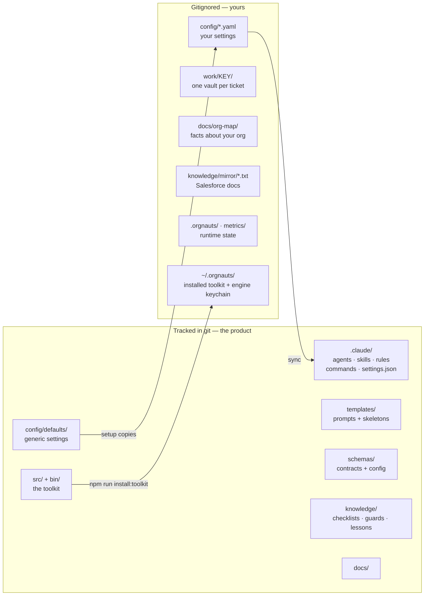

# Orgnauts — File guide: what every folder and file is for

This page answers one question for each part of the repository: **what is it, who writes it, who reads it, and when**.
Read it once; after that it is a lookup table.

Two rules make the layout easy to remember:

1. **If it is generic, it is tracked. If it is about *your* org, it is gitignored.** `npm run lint:hardcode` fails the build when something company-specific leaks into a tracked file.
2. **Agents write only in four places**: `org/force-app/`, `tests-ui/`, their own ticket vault `work/<KEY>/`, and their own memory folder. A hook (`write-guard`) refuses everything else.

---

## Top level

| Path | What it is | Who writes it | Who reads it |
|---|---|---|---|
| `README.md` | The front page | maintainers | everyone |
| `CLAUDE.md` | Instructions every Claude session in this folder reads first: how the repo is driven, the non-negotiables, how to arbitrate with the Salesforce plugin | maintainers | the conductor and every agent, at session start |
| `CHANGELOG.md` | What changed in each version | maintainers | you, before upgrading |
| `LICENSE` | MIT | — | — |
| `package.json` | The npm package: `bin` entries (`orgnauts`, `orgnauts-human`, `orgnauts-hook`, two MCP servers) and the scripts (`setup`, `build`, `test`, `verify`, `install:toolkit`) | maintainers | npm, you |
| `tsconfig.json` | TypeScript settings; `src/` compiles to `dist/` | maintainers | `npm run build` |
| `.gitignore` | Keeps personal config, vaults, org map, mirror, runtime state and secrets out of git | maintainers | git |
| `.hardcode-lint.json.example` | Shape of the gitignored `.hardcode-lint.json` where you list your own company names so the lint protects your clone | you (copy it) | `scripts/hardcode-lint.mjs` |

---

## `.claude/` — the Claude Code layer

This is what Claude Code itself loads. **The hooks and permissions in `settings.json` are the enforcement; everything else is instructions.**

| Path | What it is | Written by | Read by |
|---|---|---|---|
| `settings.json` | Hooks wiring (which `orgnauts-hook` runs on which event) and the static `permissions.deny` rules (Atlassian write tools, wrapped `sf`, the human CLI). Tracked. | maintainers | Claude Code, every tool call |
| `settings.local.json` | Deny rules for *your* preprod and production aliases and every other org in your keychain. Gitignored. | `orgnauts-human sync` | Claude Code |
| `agents/conductor.md` | The main-thread router. Its `tools:` line lists the eleven specialists it may spawn. | maintainers; `sync` rewrites `model:`/`effort:` | Claude Code when you run `orgnauts-human start` |
| `agents/a0-… a9-….md` | One file per specialist: its system prompt, model, effort, exact tool allowlist, disallowed tools, max turns, preloaded skills | maintainers; `sync` rewrites `model:`, `effort:` and (for a1) the tracker `tools:` | Claude Code when the conductor spawns that agent |
| `commands/*.md` | The slash commands: `/ticket`, `/status`, `/approve`, `/reject`, `/hold`, `/resume`, `/feedback`, `/autonomy`, `/help` | maintainers | Claude Code |
| `skills/orgnauts-core-rules/` | P1 to P12, preloaded into every agent | maintainers | every agent |
| `skills/orgnauts-*/` | Job methods: evidence contract, plan grounding, repro data first, bulk test authoring, deploy brief, escalation format | maintainers | the agents that list them |
| `skills/std-*/` | Salesforce standards: Apex conventions, trigger framework (order of execution), flow standards, naming, comments | maintainers | a2, a3, a4, a5, a6 |
| `skills/lessons-<agent>/` | Human-approved lessons, regenerated from `knowledge/lessons/` | `orgnauts-human learn` / `lessons` | the named agent |
| `skills/<prefix>-comment-conventions/`, `<prefix>-naming-rules/` | Your org's own conventions, generated from the org map. Gitignored. | `orgnauts-human conventions build` | a4, a6 |
| `rules/*.md` | Path-scoped rules Claude Code applies when an agent edits Apex, flows, metadata, UI specs or the vault | maintainers | Claude Code |
| `agent-memory/<agent>/MEMORY.md` | The agent's own unverified notes (quarantined; audited by the coach). Gitignored. | that agent | that agent; `orgnauts-human memory audit` |

`.claude-plugin/marketplace.json` pins the third-party `salesforce-development` plugin to an exact commit. See its README.

---

## `config/` — settings

Two layers, one file name: `config/defaults/<name>.yaml` is tracked and generic; `config/<name>.yaml` is your copy, gitignored. The toolkit reads your copy when it exists, the default otherwise. Every file is validated against `schemas/config/<name>.schema.json`.

| File | What it controls | Change it with |
|---|---|---|
| `orgs.yaml` | Your orgs: alias, role (`development` / `preprod` / `evidence`), keychain, `label`, `baseline_source` | setup wizard, `orgnauts-human org add`, UI → Orgs |
| `tracker.yaml` | How tickets are read: `adapter: mcp` (default), `mcp.server`, `mcp.read_tools`, or `jira` / `file`; `project_key` | setup wizard, by hand then `sync` |
| `autonomy.yaml` | Where the system stops: risk-tier matrix and the per-agent switch `agents.<agent>: ask / auto / inherit` | `orgnauts-human autonomy set`, UI → Agents |
| `safety.yaml` | Allowed test e-mail patterns, e-mail containment mode (`blocked` / `allowlist_only`), canary rules, test-tag field, browser deny rules | UI → Safety, setup wizard |
| `policy.yaml` | What the Bash policy hook denies, allowed deploy targets, baseline sync policy | by hand then `sync` |
| `models.yaml` | Model and reasoning effort per agent | UI → Agents, then `sync` |
| `budgets.yaml` | Per-ticket token/USD/time limits and the model prices used for cost | by hand |
| `masking.yaml` | Which production objects and fields the evidence server may return | by hand, with whoever owns data privacy |
| `naming.yaml` | Naming patterns the `naming-lint` gate enforces | `orgnauts-human conventions build`, by hand |
| `rewards.yaml` | Points per event for the reward ledger | by hand |
| `learning.yaml` | How lessons are proposed and promoted | by hand |
| `notify.yaml` | Optional Slack webhook (URL lives in an env var) | by hand |
| `calendar.yaml` | Release freeze windows the deploy brief respects | by hand |
| `approvers.yaml` | Who may approve which stage (informational) | by hand |
| `people/<name>.md` | Recipient profiles the comms agent writes for | you | a9-comms |

After any config change or any `sf org login/logout`: `orgnauts-human sync`.

---

## `work/<KEY>/` — one vault per ticket (gitignored)

| File or folder | Written by | Read by | When |
|---|---|---|---|
| `manifest.yaml`, `.state.json` | toolkit | toolkit, hooks, UI | the ticket's state; never edit by hand |
| `events.jsonl` | toolkit | coach, rewards, UI | every event; the only input to learning |
| `ticket.json`, `ticket.md` | toolkit (from a1's import) | every agent | the ticket text inside an `<untrusted>` envelope |
| `00-inbox/ticket-import.json`, `tracker-hits.json` | a1-intake | toolkit | the raw tracker export and the related-ticket search |
| `00c-prior-art.md` | toolkit + a1 | a1, a3 | related tickets, lessons, git history |
| `01-intake.md`, `01-intake.json` | a1-intake | you, a0b, a0, a2, a3 | understanding, acceptance criteria, scope, tier, `visual` block |
| `00b-baseline.md`, `.json` | toolkit via a0b | you, a2, a4 | which preprod org was the source, "Refresh needed: YES/NO" |
| `00d-cartography.md`, `.json` | a0-cartographer | a2, a3 | objects, automation order, dependencies |
| `02-repro.md`, `.json` | a2-repro | you, a3, a4, a5 | system walkthrough, failing test, inverse test |
| `03-plan.md`, `.json` | a3-architect | you, a4, a5, a6 | the plan with grounding table and `visual` block |
| `04-implementation.md`, `.json` | a4-developer | a5, a6 | what was built, deploy result |
| `05-test-report.md`, `.json` | a5-qa | a6 | every test and result |
| `06-review.md`, `.json` | a6-reviewer | you | verdict with evidence |
| `06b-deploy-brief.md` | a6-reviewer | you, before you deploy | by-hand steps, checks, rollback |
| `06c-deploy-manifest.md`, `.json`, `artifacts/package.xml` | toolkit (from git) | you, in your release tool | the exact component list |
| `07a-uat-parity.md` | toolkit | you | which components arrived in preprod |
| `07-uat-report.md` | a5-qa | you | preprod test results |
| `08-prod-verify.md` | toolkit | you | read-only production checks |
| `09-retro.md` | a7-coach | you | score and lesson candidates |
| `10-comms/*.md` | a9-comms | you (paste where you like) | drafts for the tracker, the client, the team |
| `visuals/intake.html`, `plan.html` | toolkit (`visual-check` gate) | anyone, in a browser | the pictures |
| `validations/<stage>-<gate>.json` | toolkit | you, when a gate fails | every gate verdict |
| `evidence/`, `artifacts/`, `ui/` | a2, a3, a4, a8 | a3, a5, a6 | masked production evidence, scripts, screenshots |
| `approvals/` | toolkit | agents on re-run | your approve/reject records and answers |

---

## `org/` — the SFDX project

| Path | What it is |
|---|---|
| `force-app/` | The **only** place agents write code and metadata. Before work starts it is refreshed from the chosen preprod org for the ticket's components. |
| `sfdx-project.json` | `sourceApiVersion` here is what plans are checked against. Keep it equal to your org's API version. Protected: agents cannot edit it. |
| `.forceignore` | Profiles, settings and credential-bearing metadata never travel through agents. Protected. |
| `.baseline/` | Raw retrieves (`uat/<ts>/`, `dev/<ts>/`) that prove the baseline comparison. Gitignored. |

---

## `knowledge/` — what agents may know

| Path | What it is | Written by |
|---|---|---|
| `checklists/*.yaml` | Architecture, data, deployment, e-mail, flow, limits, security, sharing, test-data questions the plan must answer (`checklist` gate) | maintainers, you |
| `guards/injection-patterns.txt`, `comms-forbidden.txt` | Phrases that mark prompt injection in tickets; words a client draft may never contain | maintainers, you |
| `lessons/PENDING/` | Lesson candidates waiting for your decision | a7-coach |
| `lessons/L-*.md`, `INDEX.md` | Approved lessons | `orgnauts-human lessons`, `/feedback` |
| `mirror/sources.yaml` | Which Salesforce documentation files to download; `trusted_domains` | maintainers, you |
| `mirror/*.txt` | The downloaded documentation agents cite by file and line. Gitignored. | `orgnauts-human mirror` |
| `curated/*.md` | Expert notes a human read and filed, with `source_url`, `author`, `trust` | you |

---

## `templates/` — what agents are told, and what they fill in

| Path | What it is |
|---|---|
| `prompts/<agent>[.<stage>[.<CLASSIFICATION>]].md` | The task prompt the conductor hands to a specialist. Placeholders (`{{TICKET}}`, `{{VISUAL}}`, `{{TICKET_IMPORT}}`, …) are filled by `orgnauts agent handoff`. |
| `01-intake.md … 07-uat-report.md` | The skeleton of each stage file, with the headings the gates look for |
| `comms/*.md` | Skeletons for the three drafts |
| `inbox-ticket.md` | The ticket file to copy when you have no tracker |
| `repro-data.apex` | The anonymous Apex skeleton for test data |
| `lesson.md` | The lesson file shape |

---

## `schemas/` — the contracts

| Path | What it validates |
|---|---|
| `manifest.schema.json` | `work/<KEY>/manifest.yaml` |
| `config/*.schema.json` | each `config/*.yaml` file (doctor check 1) |
| `contracts/*.schema.json` | each stage's JSON output (`contract-check` gate): intake, plan, repro, implementation, test-report, review, comms, cartography, prior-art, ticket-import |

---

## `src/` and `bin/` — the toolkit

Plain TypeScript, no AI calls. `npm run build` compiles to `dist/`; `npm run install:toolkit` copies it to `~/.orgnauts/toolkit` and writes the launchers hooks call. **Hooks run the installed copy**, so after any toolkit change run `install:toolkit` again.

| Folder | What lives there |
|---|---|
| `src/cli/agent.ts` | `orgnauts agent …` verbs agents may run: `open`, `handoff`, `status`, `baseline`, `ticket import`, `visual`, `prior-art`, `evidence`, `privileged`, `canary`, `deploy-manifest`, … |
| `src/cli/human.ts` | `orgnauts-human …` verbs only you run: `setup`, `start`, `approve`, `reject`, `deployed`, `autonomy`, `baseline decide`, `org`, `sync`, `doctor`, `ui`, `lessons`, `learn`, … |
| `src/core/` | `state-machine.ts` (the 19 stages and who stops), `manifest.ts`, `config.ts` (layered config), `events.ts`, `sf.ts` (every `sf` call), `paths.ts` |
| `src/gates/` | The mechanical checks: `contract.ts`, `grounding.ts` (plan-lint, semantic-check), `hygiene.ts` (email, naming, comments, security), `verdicts.ts` (baseline, deploy, parity, referee), `vault.ts` (ticket-import, visual-check) |
| `src/hooks/` | `fast.ts` (deny rules, zero dependencies, fail closed), `heavy.ts` (stage-gate, prompt-router, stop-guard), `dispatch.ts` |
| `src/engines/` | `lifecycle.ts` (open, import, resume, deployed), `baseline.ts`, `visual.ts`, `uihosts.ts`, `deploy-manifest.ts`, `priorart.ts`, `learn.ts`, `tokens.ts`, `sync.ts`, `setup.ts`, `mirror.ts`, `orgmap.ts`, `tracker/` (mcp, jira, file), `evidence/` |
| `src/privileged/` | Steps that touch orgs with care: canary, dev deploy, preprod validate, test runs, parity |
| `src/mcp/` | `evidence-server.ts` (masked production reads), `ui-server.ts` + `ui-fence.ts` (the fenced browser) |
| `src/ui/` | The local web UI (`orgnauts-human ui`) |
| `src/doctor/` | Every health check |
| `bin/*.js` | The five entry points |

More detail: `src/README.md`.

---

## `scripts/`, `test/`, `tests-ui/`, `spikes/`, `benchmarks/`

| Path | What it is |
|---|---|
| `scripts/run-tests.mjs` | Runs `test/*.test.mjs` offline (`ORGNAUTS_OFFLINE=1`, no `sf` call leaves the suite) |
| `scripts/hardcode-lint.mjs` | Fails when a tracked file holds a real ticket key, e-mail, org id or hostname |
| `scripts/repo-checks.mjs` | Checks hooks are wired, agents are well-formed, one product name everywhere |
| `scripts/hooks-latency.mjs` | Measures each blocking hook (p50/p95) against the installed copy |
| `scripts/install-toolkit.mjs` | Installs `~/.orgnauts/toolkit` and `~/.orgnauts/bin/*` |
| `test/*.test.mjs` | 119 offline tests: config, state machine, hooks, gates, lifecycle, UI MCP, hard rules, v0.3.0 features, setup |
| `tests-ui/` | Optional Playwright specs drafted by a8/a5; `auth.setup.ts` refuses production |
| `spikes/` | Short experiments to run once against *your* orgs before the first real ticket |
| `benchmarks/golden-tickets/` | Sealed solved tickets, replayed to detect drift after model or prompt changes |

---

## Outside the repository

| Path | What it is |
|---|---|
| `~/.orgnauts/toolkit/`, `~/.orgnauts/bin/` | The installed toolkit copy the hooks run. Agents cannot edit it. |
| `~/.orgnauts/engine/` | The **engine keychain**: a second `HOME` for the Salesforce CLI that holds preprod logins only. Agents cannot read it. |
| `$HOME/.sf/` (your default keychain) | The **agent keychain**: the dev sandbox and the production read-only user |
| `.orgnauts/` (in the repo, gitignored) | Runtime state: canary results, evidence log, caches, `ui-allow-hosts.json` (the one-ticket preprod browser window) |
| `metrics/` (gitignored) | Token and cost records, rewards |
