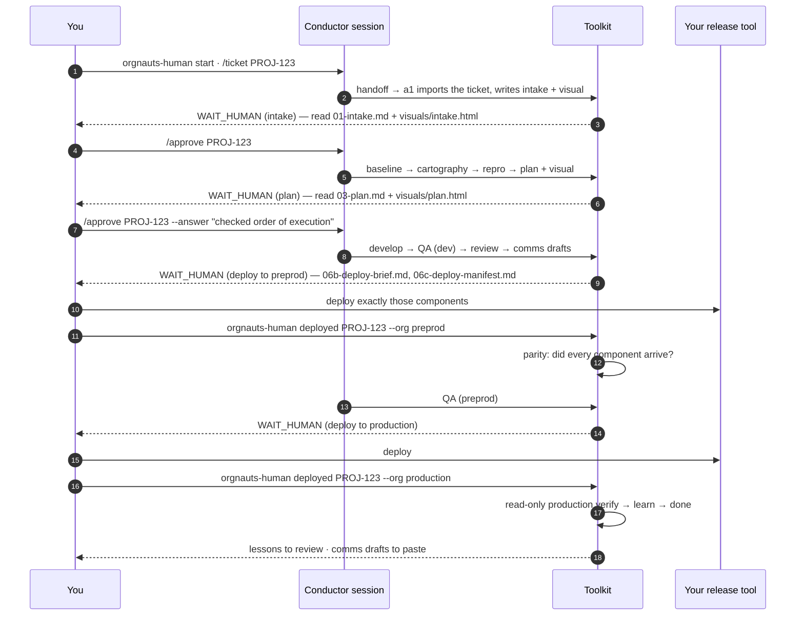

# Orgnauts — Runbook: using it day to day

This page is for the person who drives Orgnauts. It answers three questions: **what does a normal ticket look like for me**, **what do I do when it stops**, and **what do I do when something is wrong**.

---

## 1. A normal ticket, from your side



Commands you will use every day:

```bash
orgnauts-human doctor          # 30 seconds. Green? go.
orgnauts-human start           # the conductor session
> /ticket PROJ-123
> /status
orgnauts-human ui              # in another terminal: watch, approve, edit config
```

---

## 2. When it stops: what it says, what you do

Every stop ends with **"Stopped because: …"** naming the rule that applied, and names the visual page when the stage has one.

| It says | You do |
|---|---|
| **approval at intake / plan / review** | Read the file it names (`work/PROJ-123/01-intake.md`, `03-plan.md`, `06-review.md`). For intake and plan, open the visual in a browser (`visuals/intake.html`, `visuals/plan.html`). Then `/approve PROJ-123 [--answer "what you checked"]` or `/reject PROJ-123 --reason "…"`. The UI buttons do the same. |
| **baseline: which source?** | Several preprod orgs are configured and none is chosen for this ticket. `/approve PROJ-123 --stage baseline --answer "source:UAT"` or `orgnauts-human baseline decide PROJ-123 --source UAT`. The candidates and their labels are in the prompt. |
| **baseline decision** | Dev has work preprod does not (or both changed). `orgnauts-human baseline decide PROJ-123 --keep-dev Type:Name --take-uat Type:Name` (or `--all-take-uat`). |
| **deploy to preprod** | Read `06b-deploy-brief.md` (by-hand steps: FLS permission set, assignees, flow activation, environment-specific ids). Select **exactly** the components in `06c-deploy-manifest.md` (`artifacts/package.xml`) in your release tool. Deploy. Then `orgnauts-human deployed PROJ-123 --org preprod`. The toolkit retrieves those components from preprod and compares fingerprints (`07a-uat-parity.md`). MISSING or DIFFERENT → it comes back to you with the list; fix the set and run `deployed` again. NOT VERIFIED (retrieve failed) → fix the cause, or if you verified another way: `orgnauts-human parity PROJ-123 --accept-all --reason "…"`. When parity passes, the preprod browser window opens for this ticket's QA. |
| **deploy to production** | Same, with `--org production`. The toolkit then runs the read-only verification queries from the plan. |
| **remediation** | Run `work/PROJ-123/artifacts/remediation/*.apex` yourself in production, then `orgnauts-human verify PROJ-123 --remediation`. |
| **question / escalation** | Read the ESCALATION block in the stage file. Answer in the session, or `/hold`, or `/resume PROJ-123 --restart-from <stage>`. |

`/hold PROJ-123 --reason "…"` pauses the ticket. `/resume PROJ-123` re-checks the ticket for changes (comments only → continue; description or acceptance criteria changed → intake re-runs; scope changed → restart from baseline; cancelled → archive), detects a sandbox refresh, and re-checks the baseline.

---

## 3. Your controls

### Where the system stops (per agent)

```bash
orgnauts-human autonomy show                   # mode per agent, the tier matrix, the hard floor
orgnauts-human autonomy set a1-intake ask      # always stop after intake
orgnauts-human autonomy set a4-developer auto  # never stop after the developer
orgnauts-human autonomy set a3-architect inherit   # back to the tier matrix
```

`ask` stops for `/approve` after that agent, whatever the tier. `auto` never stops there. `inherit` (default) follows the tier matrix in `config/autonomy.yaml`: HIGH stops at intake, plan and review; MEDIUM at plan; LOW nowhere. Deploys and remediation always stop. It applies to the next stage decision; no restart needed. UI → Agents → gate column does the same.

### Which preprod org is the baseline

Configure each preprod org with `role: preprod`, a `label:`, and mark the usual one `baseline_source: true` (UI → Orgs, or `orgnauts-human org add --role preprod --keychain engine`). `work/PROJ-123/00b-baseline.md` says which source was used and **Refresh needed: YES/NO**. Only the ticket's components are copied, always source → dev. Dev is never copied anywhere.

### The visuals

`work/PROJ-123/visuals/intake.html` ("What is the issue? What must be done? One real example") and `visuals/plan.html` ("Root cause. The fix, step by step. One real example"), each with two diagrams and a glossary. Open the file in any browser; share it with the person who asked for the ticket. Re-render by hand: `orgnauts agent visual PROJ-123 --stage intake|plan`.

### QA in preprod with the browser

After `deployed --org preprod` and a passing parity check, the toolkit writes `.orgnauts/ui-allow-hosts.json` for that one ticket. While the ticket is at `qa_uat`, a5-qa (and a8-ui) can log the fenced browser into preprod through the **engine** keychain, read-only; the agent never sees the credential. The window closes when you mark the production deploy, hold the ticket, or it finishes. Make the engine's preprod login a least-privilege **test** user.

### Refreshing the ticket from the tracker

With the `mcp` adapter the toolkit holds no credential, so it cannot re-fetch the ticket itself. `/resume PROJ-123` asks the intake agent to re-import on its next run. To force it now, drop the current ticket text as `inbox/PROJ-123.md` and `/resume`. A re-import is a refresh: `work/PROJ-123/ticket-diff.md` says what changed.

### Allowed test e-mails and delivery mode

UI → Safety: add or remove patterns, pick `blocked` (default: the canary must prove the org refuses to send) or `allowlist_only` (delivery may be ON; the canary's census must find no address outside the list). Saving writes `config/safety.yaml`.

---

## 4. Weekly

- `orgnauts-human learn` → `knowledge/DIGEST-<date>.md`; `orgnauts-human lessons review` → approve or reject with reasons.
- `orgnauts-human rewards --tokens` → points and spend per agent (UI → Agents shows the same).
- `orgnauts-human memory audit` → flags agent notes that contradict events.
- `orgnauts-human orgmap` → refreshes `docs/org-map/` (gitignored). Review `CONVENTIONS.md` once, then `orgnauts-human conventions build --prefix <yourorg>` generates the org-specific comment and naming skills and wires them into the agents.
- `orgnauts-human mirror` → refreshes the Salesforce documentation mirror (trusted domains only). Expert notes go to `knowledge/curated/` with provenance.
- UI → Safety → review the allowed test e-mail list, the delivery mode and the last canary.

---

## 5. When something is wrong

| Symptom | Where to look | Fix |
|---|---|---|
| `start` refuses | doctor output | fix the named check; `--force` is for emergencies only |
| `ticket-import` gate fails ("the ticket has not been imported yet") | `work/PROJ-123/00-inbox/` | a1 must read the ticket through the tracker MCP and run `orgnauts agent ticket import`. If the MCP server is not connected (`claude mcp list`), connect it; or drop the ticket as `inbox/PROJ-123.md` and re-open |
| `policy.denied` with rule `T1-tracker-readonly` | `events.jsonl`, UI → Safety tile | an agent asked for a tracker tool outside `config/tracker.yaml → mcp.read_tools`, or a write tool. Writes are never allowed. If a READ tool is missing, add it and `orgnauts-human sync` |
| `visual-check` fails ("visual block … incomplete") | `validations/<stage>-visual-check.json` | the agent's visual block is thin or a diagram is broken; it fixes it on the bounce. Render by hand: `orgnauts agent visual PROJ-123 --stage intake|plan` |
| it stops where you did not expect (or does not stop where you want) | the prompt's "Stopped because: …" | `orgnauts-human autonomy show`, then `autonomy set <agent> ask|auto|inherit` |
| `ui_login` refused for the preprod alias during `qa_uat` | `.orgnauts/ui-allow-hosts.json`, `work/PROJ-123/.state.json` | the window exists only while THIS ticket is at `qa_uat` after parity passed. If the preprod URL could not be resolved, fix the engine keychain login and run `deployed --org preprod` again |
| `policy.denied` with `R7-wrapped-sf` / `R2-env-prefix` / `R1-human-verbs` | `events.jsonl` | the agent tried `sf` through a wrapper, with an env prefix, or the human CLI by path. It must use plain `sf … -o <dev alias>` or the `orgnauts agent …` wrappers. Never widen the hook |
| an agent is denied constantly | `events.jsonl`, UI → Safety tile | it is trying the wrong thing; read the reason. If a legitimate path is missing, add a toolkit verb; never widen the hook |
| a stage keeps failing gates | `validations/<stage>-<gate>.json` | the reason is mechanical; fix the artifact or the config the gate reads |
| handoff keeps saying `WAIT_AGENT` | `manifest.yaml → stages.<stage>.agent_waits` | the agent has not reported back. Normal while it works; after 8 waits the stage fails honestly. `/resume PROJ-123` first: if its gates now pass, the stage is recovered without a re-run |
| a stage failed but its output looks complete | `validations/` | `/resume PROJ-123` re-runs that stage's gates; all passing → marked done with no agent re-run. `--restart-from` forces the re-run |
| budget parked | `manifest.yaml → budget` | raise `config/budgets.yaml` or `/resume PROJ-123 --allow-budget` |
| canary FAIL | `.orgnauts/canary/<org>.json`, UI → Safety | `blocked` mode: Setup → Email → Deliverability → *No access* (or *System email only*); rerun `orgnauts agent canary`. `allowlist_only` mode: the census found addresses outside the allowlist; the UI shows which fields; scrub them or switch to `blocked` |
| canary stale (doctor 10 WARN) | UI → Safety | a PASS older than `canary_max_age_minutes` is not accepted; rerun `orgnauts agent canary --org <dev>` before a2 or a5 create data |
| `uat_verify` keeps sending the ticket back | `07a-uat-parity.md` | the deploy set in your tool does not match `06c-deploy-manifest.md`. A cosmetic DIFFERENT (the tool rewrote the api version) can be accepted: `orgnauts-human parity PROJ-123 --accept Type:Name --reason "…"` |
| doctor 17 FAIL (knowledge sources) | `knowledge/mirror/sources.yaml` | a mirror source is not on a Salesforce documentation domain; remove it. Expert articles go to `knowledge/curated/` |
| preprod validate fails | `validations/uat-validate.json` | usually drift preprod↔dev outside scope: widen scope (`orgnauts agent scope set`) and rerun baseline |
| hooks not firing | `claude --debug`, doctor 9 | installed copy missing or outdated → `npm run install:toolkit`; check PATH |
| UI shows config errors | Config tab | fix the YAML; every save is schema-validated |

**Escape hatches** (human, documented, audited): `ORGNAUTS_HOOKS_OFF=1` disables the Orgnauts hooks for a session; `claude --settings disableAllHooks` disables all hooks. Both leave the identity-level protections (read-only user, keychain split) in place.

---

## 6. Maintenance

| Task | How |
|---|---|
| Add an org | UI → Orgs → Add, or `orgnauts-human org add --alias X --role development|preprod|evidence` → `org login` → `doctor`. Preprod orgs always live in the engine keychain; evidence orgs need a read-only user. |
| Change models, effort or gate modes | UI → Agents, or edit `config/models.yaml` / `config/autonomy.yaml` → `orgnauts-human sync`. Models take effect in the next session; the gate column applies at once. Run the golden set after a model or effort change: `orgnauts-human golden list|score`. |
| Read token and cost numbers | `tokens` in the manifest is the raw total including cache reads; `fresh_tokens` (input + output + cache creation) is what the budget is judged on. Costs come from `config/budgets.yaml → prices`; doctor 16 warns when a model you run has no price. |
| Bump the plugin pin | `.claude-plugin/README.md`: read the upstream diff, run Spike 1, update `sha` + `version`, `/plugin update`, `doctor`, note it in `docs/DECISIONS.md`. |
| Upgrade the toolkit | `git pull` → `npm ci && npm run build && npm test` → `npm run install:toolkit` → `orgnauts-human sync && orgnauts-human doctor`. |
| Seal a golden ticket | After a ticket closes cleanly: `orgnauts-human golden add PROJ-123`. |
| Pipeline mode (API key) | `ANTHROPIC_API_KEY=… orgnauts-human run PROJ-123` runs the conductor in a resume loop with `--max-budget-usd`; stops at every human gate. |

### Files you may edit by hand

`config/*.yaml` (then `sync`) · `knowledge/checklists/*.yaml` · `knowledge/guards/*.txt` · `knowledge/curated/*` · `knowledge/lessons/L-*.md` (then `learn sync`) · `templates/**` · `Example/Flows/*` · `docs/**` · `inbox/<KEY>.md` · `.claude/agents/*.md` (prose; `tools:`/`model:`/`effort:` lines are rewritten by `sync`) · `.claude/skills/**` (except generated `lessons-*` and `<prefix>-*`) · `.claude/rules/*` · `.claude/commands/*` · `CLAUDE.md`.

**Never edit by hand:** `work/**/manifest.yaml`, `.state.json`, `events.jsonl`, `validations/`, `approvals/`, `06c-deploy-manifest.*`, `07a-uat-parity.md`, `visuals/*.html`, `.mcp.json`, `.orgnauts/`.
