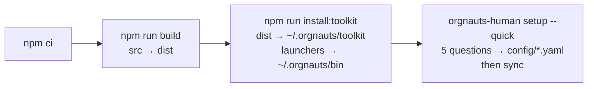
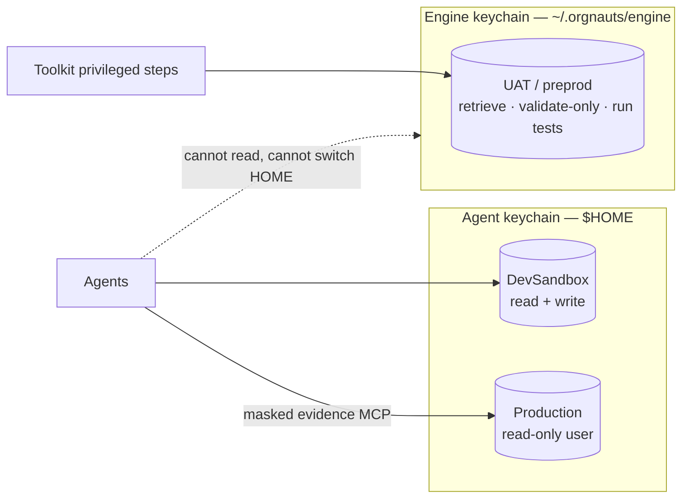

# Orgnauts — Setup

Two paths. Start with the quick one; you can add the rest later.

| Path | Time | You need | You get |
|---|---|---|---|
| **Quick** | ~15 minutes | one development sandbox, Jira connected in Claude Code (or no tracker) | the whole pipeline up to "deploy to preprod"; preprod and production stages are skipped and recorded as skipped |
| **Full** | ~2 hours | plus a preprod org and a production read-only user | baseline sync from preprod, preprod parity and QA, read-only production evidence and verification |

macOS and Linux. **Windows is not supported** (the hooks are `sh` launchers and the engine keychain is a `HOME` override). Use WSL or a Linux VM.

---

## Step 0 — Check the prerequisites

```bash
orgnauts-human doctor --preflight     # after step 1; setup also prints this table before its first question
```

| Id | Check | If missing | Install |
|---|---|---|---|
| 0a | Node.js ≥ 20.10 | setup stops | `nvm install 22` or your package manager |
| 0b | Salesforce CLI `sf` | setup stops | `npm i -g @salesforce/cli`, then open a new terminal |
| 0c | git | setup stops | install git |
| 0d | Claude Code `claude` | warning (agents run inside it; setup does not) | install Claude Code |
| 0e | python3 | optional | only the spikes and some plugin scripts |
| 0f | Playwright | optional | `npm i -D playwright && npx playwright install chromium` (browser QA) |

Also needed, not in the table:

- **One development sandbox you may break.** It is the only org agents write to. Each developer uses their own.
- **A tracker, one of:** the Atlassian (Jira) MCP server connected in Claude Code (`claude mcp list` shows `atlassian`) · any other tracker with an MCP server · no tracker (tickets as files in `inbox/`).
- **Your own admin production login must not be in the default `sf` keychain on this machine.** Doctor check 6 fails if it is. Log it out (`sf org logout -o <alias>`) or do admin work as another OS user.

---

## Step 1 — Install (quick path)

```bash
git clone https://github.com/KhaddaAiLabs/orgnauts.git && cd orgnauts
npm run setup
export PATH="$HOME/.orgnauts/bin:$PATH"       # add this line to ~/.zshrc or ~/.bashrc too
```

`npm run setup` does four things: `npm ci` → `npm run build` → `npm run install:toolkit` → `orgnauts-human setup --quick`.



Why the copy in `~/.orgnauts`? The hooks in `.claude/settings.json` call **that** copy, not the repository. So agents can never edit the code that enforces the rules. After you change the toolkit yourself, run `npm run install:toolkit` again (doctor check 9e warns when the two differ).

If `npm run setup` says "no package-lock.json in this folder", you are not in the repository root.

### The five questions

Press Enter to keep the default shown in `[…]`. Type a value, never the brackets.

| # | Question | Default | Written to |
|---|---|---|---|
| 1 | Development sandbox alias (the only org agents deploy to) | `DevSandbox` | `config/orgs.yaml`, `config/policy.yaml → allowed_deploy_targets` |
| 2 | Tracker project key (only this prefix may open a ticket) | `DEMO` | `config/tracker.yaml → project_key` |
| 3 | Allowed TEST e-mail patterns. Add your own pattern, for example `you+*@yourcompany.example` | `*@example.com,*.invalid` | `config/safety.yaml → allowed_test_emails` |
| 4 | Tracker: `mcp` (then the MCP server name, default `atlassian`) · `jira` (REST token) · `file` | `mcp` | `config/tracker.yaml → adapter`, `mcp.server` |
| 5 | Preprod/UAT alias, or `none` for dev-only | `none` | `config/orgs.yaml` |

Non-interactive, same result:

```bash
orgnauts-human setup --quick --non-interactive --dev DevSandbox --project PROJ --emails "you+*@yourcompany.example" --tracker mcp --mcp-server atlassian
```

Your `config/*.yaml` files are personal copies (gitignored). Anything you did not personalise comes from `config/defaults/`. Setup ends with `sync`, which writes `.mcp.json` (the `sf-dev` MCP server bound to your dev alias), the compiled hook policy, the agents' model lines and the tracker's read tools on the intake agent.

---

## Step 2 — Log in to the dev sandbox and run the health check

```bash
orgnauts-human org login --alias DevSandbox --keychain agent     # browser login; your default sf keychain = the AGENT keychain
export ORGNAUTS_CANARY_EMAIL=you@yourcompany.example             # the canary's only recipient: your own address (env var, never config)
orgnauts-human doctor                                            # every check; `start` refuses while any FAIL remains
```

Then, once, inside a Claude Code session in this folder (type the whole line; `/plugin` alone opens a menu):

```text
/plugin marketplace add ./
/plugin install salesforce-development@orgnauts-pinned
```

---

## Step 3 — First ticket

```bash
orgnauts agent canary --org DevSandbox     # must PASS: the dev sandbox refuses to send e-mail
orgnauts-human start                       # the conductor session
> /ticket PROJ-123
```

**What happens first.** With the `mcp` tracker the conductor spawns a1-intake. It reads the ticket through the MCP read tool (`getJiraIssue`), saves the raw result as `work/PROJ-123/00-inbox/ticket-import.json`, and runs `orgnauts agent ticket import`. The toolkit validates it, wraps the text as untrusted data, writes `ticket.md`, and indexes prior art. A gate refuses to move on while the import has not happened. With the `file` tracker the same import reads `inbox/PROJ-123.md`.

**Where to look when it stops.** `orgnauts agent status PROJ-123` · `orgnauts-human ui` · `work/PROJ-123/visuals/intake.html` in a browser · `work/PROJ-123/events.jsonl`. Approve with `/approve PROJ-123`, reject with `/reject PROJ-123 --reason "…"`. What to do at every stop: [RUNBOOK.md](RUNBOOK.md).

---

## Step 4 — Add preprod (full path)

Every developer has their own dev sandbox, but preprod is shared, so it may already hold another developer's work. Orgnauts refreshes your dev sandbox from preprod **for the ticket's components only**, after comparing, and only where they differ.

Preprod lives in a **second keychain** that agents cannot read:



```bash
orgnauts-human org add --alias UAT --role preprod --keychain engine
orgnauts-human org login --alias UAT --keychain engine
orgnauts-human org list
orgnauts-human sync && orgnauts-human doctor
```

**Several preprod orgs** (a shared UAT, a QA copy, a staging org): add each with `role: preprod`, give it a `label:` and mark the usual one `baseline_source: true` in `config/orgs.yaml`. When a ticket should use another one, answer the baseline question: `/approve PROJ-123 --stage baseline --answer "source:QA"` or `orgnauts-human baseline decide PROJ-123 --source QA`.

The preprod login the toolkit uses for browser QA should be a **least-privilege test user**: during a ticket's `qa_uat` stage the fenced browser can do whatever that user can do.

---

## Step 5 — Add the production read-only user (full path, admin, once)

Orgnauts reaches production only as this user. **Its permissions are the boundary.** Recipe: [`spikes/A-prod-readonly-user/RECIPE.md`](../spikes/A-prod-readonly-user/RECIPE.md): a minimum-access profile, a permission set with object and field **Read** only on the objects and fields listed in `config/masking.yaml`, *View Setup and Configuration*, API enabled, login IP ranges.

```bash
orgnauts-human org login --alias Production --keychain agent      # log in AS that read-only user
orgnauts-human doctor --p1 --fls                                  # 5: the user cannot modify data or metadata · 12: masking allowlist vs the real describe
```

---

## Step 6 — Other settings you may tune

| File | Why you might change it |
|---|---|
| `config/autonomy.yaml` | where the system stops for you, per agent: `orgnauts-human autonomy set a3-architect ask` |
| `config/models.yaml` | model and reasoning effort per agent (`CLAUDE_CODE_EFFORT_LEVEL` in your shell overrides them; doctor 15 warns) |
| `config/budgets.yaml` | token, USD and time limits; the model prices cost is computed from |
| `config/masking.yaml` | what production evidence may contain; review with whoever owns data privacy |
| `config/safety.yaml` | allowed test e-mails and the containment mode; the UI → Safety screen edits it |

Secrets never go in config. `ORGNAUTS_JIRA_TOKEN`, `ORGNAUTS_SLACK_WEBHOOK`, `ORGNAUTS_CANARY_EMAIL` and `ANTHROPIC_API_KEY` (pipeline mode) are environment variables. Run `orgnauts-human sync` after any config change or any `sf org login/logout`.

**Spikes (once, before the first real ticket).** [`spikes/README.md`](../spikes/README.md) lists seven short experiments that settle the open questions against *your* orgs (plugin coexistence, Tooling rights of the read-only user, a repro by hand, a baseline by hand, the canary result shape, the read-only user recipe, live hook behaviour). Record findings as `spikes/<n>/findings-<date>.md` (gitignored).

---

## Doctor checks

`orgnauts-human doctor` prints every check below. `--p1 --email-canary --hooks-latency --fls` (or `--all`) add the live ones; `--preflight` prints only 0a–0f; `--json` is for machines. `start` refuses to launch while any check FAILs; warnings do not block. With `ORGNAUTS_OFFLINE=1` no `sf` process is spawned and the org checks print an honest "skip (offline)".

| Id | Meaning |
|---|---|
| 0a–0f | preflight: node ≥ 20.10 · sf CLI · git · claude · python3 (optional) · Playwright (optional) |
| 1 | every `config/*.yaml` loads and validates against its schema |
| 2a | Salesforce CLI present (skip when offline) |
| 2b | Node.js ≥ 20.10 |
| 2c | git present |
| 2d | python3, jq (optional tools the plugin scripts use) |
| 2e | `sf plugins`: code-analyzer and plugin-flow installed |
| 2f | `SFDX_AUTO_DEPLOY=1` is set (FAIL: the plugin would deploy on every edit) |
| 2g | the default `sf` target-org is unset or the development org |
| 2h | `org/sfdx-project.json → sourceApiVersion` matches the dev org's API version (after `orgnauts agent cache freshen`) |
| 3a | AGENT keychain lists the development org |
| 3b | AGENT keychain lists the evidence (production) org |
| 3c | preprod is NOT in the AGENT keychain (or: no preprod configured; preprod stages skipped) |
| 4a, 4b | ENGINE keychain lists preprod, and only preprod |
| 5, 5b | the production user cannot Modify All Data / Modify Metadata / Author Apex / Customize Application; has View Setup (`--p1`) |
| 6, 6b | no second (admin) production login in the AGENT keychain; the evidence alias is the configured read-only user |
| 7 | no Blue Canvas git remote in this repository |
| 8 | `.mcp.json`: `sf-dev` bound to the development org only, no preprod/prod servers |
| 8b | tracker adapter: `mcp` → the MCP server's READ tools are on the intake agent and no write tool is · `jira` → env vars set · `file` → inbox |
| 9a, 9b | `.claude/settings.json` wires the Orgnauts hooks; static deny rules present |
| 9c | the `salesforce-development` plugin is installed |
| 9d | Claude Code auto memory on |
| 9e | the installed toolkit copy (`~/.orgnauts`) matches the repository version |
| 9f | compiled policy for the fast hooks exists (`sync`) |
| 9g | static denies cover every non-development org in the AGENT keychain |
| 9h | tests are offline: `scripts/run-tests.mjs` sets `ORGNAUTS_OFFLINE` |
| 10 | e-mail canary: last result and freshness; `--email-canary` runs it |
| 11-\<hook\> | hook latency per blocking hook (`--hooks-latency`) |
| 12-\<object\> | masking allowlist vs the production describe (`--fls`) |
| 13 | oracle cache (describe/metadata) present for plan-lint |
| 14 | package schemas and templates present |
| 15 | reasoning effort per agent, and the `CLAUDE_CODE_EFFORT_LEVEL` override |
| 16 | model prices present so USD budgets can fire |
| 17 | knowledge sources on Salesforce domains only; curated notes carry provenance |
| 18 | e-mail containment mode and the allowlist |

---

## Troubleshooting

| Symptom | Fix |
|---|---|
| `npm ci` fails: "no package-lock.json" | You are in the wrong folder. Run it in the repository root. |
| The wizard wrote `[*@example.com,*.invalid]` as one pattern | The brackets show the default. Press Enter to keep it or type the values without brackets. Fix `config/safety.yaml` (or UI → Safety) if a bracket slipped through. |
| `/plugin marketplace add` says the path is invalid | Local paths must start with `./`. A stale marketplace: `claude plugin marketplace remove orgnauts-pinned` first. |
| Canary FAILs or never runs | Export `ORGNAUTS_CANARY_EMAIL=you@yourcompany.example` and set the dev sandbox's Deliverability to *No access* or *System email only* (Setup → Email → Deliverability). Then `orgnauts agent canary --org DevSandbox`. Data steps are refused until a fresh PASS exists (doctor 10). |
| hooks-latency fails on a laptop | The budget is a p95 of 2500 ms after a warm-up. A high p95 next to a low p50 is spawn noise from other work; rerun on a quiet machine. |
| Seeding test data fails on `Test_Tag__c` | Every object agents seed needs that custom text field. Create it in the dev sandbox, or point `config/safety.yaml → test_tag_field` at the field you have. |
| plan-lint rejects a valid API | `org/sfdx-project.json → sourceApiVersion` is older than your org. Set it to the org's version (`sf org display -o DevSandbox` shows it). |
| Doctor 9e says the installed copy differs | `npm run install:toolkit` after every toolkit change. |
| `sync` warns "sf org list unavailable" | The sf CLI was not reachable; run `orgnauts-human sync` again with `sf` on PATH. |
| `ticket-import` gate fails ("the ticket has not been imported yet") | The MCP server is not connected in Claude Code (`claude mcp list`), or the agent did not run the import. Connect it, or drop the ticket as `inbox/PROJ-123.md` and re-open. |

---

## Upgrade, uninstall, reset

**Upgrade:** `git pull` → `npm ci && npm run build && npm test` → `npm run install:toolkit` → `orgnauts-human sync && orgnauts-human doctor`.

**Uninstall:** `rm -rf ~/.orgnauts` removes the installed toolkit and the engine keychain (log out of preprod first: `HOME=~/.orgnauts/engine sf org logout -o UAT`). Runtime state lives in `work/`, `.orgnauts/`, `metrics/`, `org/.baseline/`, all gitignored.

**Before you publish a fork:** everything generated from your org is gitignored, and `npm run lint:hardcode` fails if a generated org file is tracked. Put your own company names in `.hardcode-lint.json` (see the `.example`).
