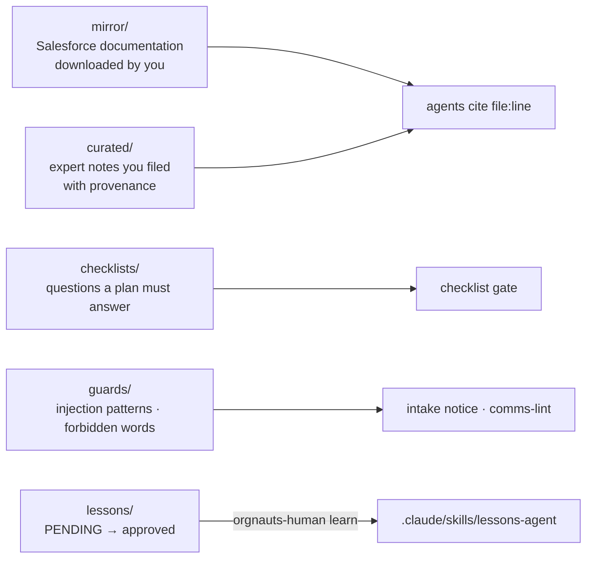

# knowledge/ — what the agents are allowed to know

Agents never browse the web (every agent file denies `WebFetch` and `WebSearch`; `npm run check:repo` verifies it). Everything they may cite as platform knowledge, and everything that steers their judgement, lives here.

| Folder | What it holds | Who writes it | Who uses it |
|---|---|---|---|
| `checklists/*.yaml` | architecture, data, deployment, e-mail, flow, limits, security, sharing, test-data questions the plan must answer (n/a needs a note) | maintainers, you | a3-architect; the `checklist` gate |
| `guards/injection-patterns.txt` | phrases that mark prompt injection inside a ticket | maintainers, you | a1-intake (injection notice) |
| `guards/comms-forbidden.txt` | words a client-visible draft may never contain | maintainers, you | the `comms-lint` gate |
| `lessons/PENDING/` | lesson candidates waiting for your decision | a7-coach | you (`orgnauts-human lessons review`, UI → Lessons) |
| `lessons/L-*.md`, `INDEX.md` | approved lessons | `orgnauts-human lessons`, `/feedback` | regenerated into `.claude/skills/lessons-<agent>/` |
| `lessons/RETIRED/` | lessons you rejected or retired | the toolkit | nobody |
| `mirror/sources.yaml` | which Salesforce documentation files to download, and the `trusted_domains` list | maintainers, you | `orgnauts-human mirror` |
| `mirror/*.txt` | the downloaded documentation (gitignored, large, Salesforce-licensed) | `orgnauts-human mirror` | a3 and others cite `file:line` |
| `curated/*.md` | notes a human read and filed, each with `source_url`, `author`, `trust`, `retrieved`, `added_by` | you | agents cite them as grounding layer L2 |

Rules:

- A platform claim without a `knowledge/mirror` or `knowledge/curated` reference is **unverified** and must be marked so in the plan's grounding table (P12).
- A stale curated note is worse than none, because agents trust it. Mark superseded notes and remove them.
- Lessons come only from events, rewards and human decisions (P6). An agent's own claim about itself is not evidence.
