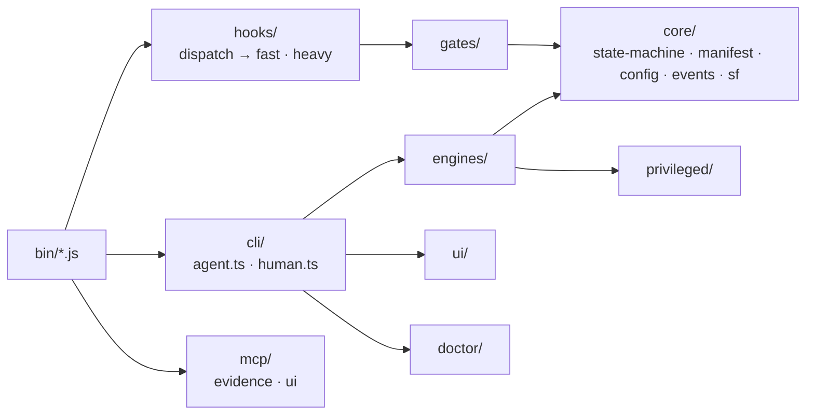

# src/ — the toolkit

Plain TypeScript. **No AI calls anywhere in this folder.** It owns the facts (state, config, events), the judgements that must be mechanical (gates, hooks) and the work behind every command (engines). `npm run build` compiles it to `dist/`; `npm run install:toolkit` copies `dist/` to `~/.orgnauts/toolkit` and writes the launchers in `~/.orgnauts/bin` that the Claude Code hooks call.



| Folder | What it does | Start here |
|---|---|---|
| `cli/agent.ts` | `orgnauts agent …`: the verbs agents may run (`open`, `handoff`, `status`, `baseline`, `ticket import`, `visual`, `prior-art`, `evidence`, `privileged`, `canary`, `analyze`, `deploy-manifest`, `cache`, `learn-digest`) and the prompt rendering for each spawn | `handoff()` |
| `cli/human.ts` | `orgnauts-human …`: the verbs only you run (`setup`, `start`, `approve`, `reject`, `hold`, `resume`, `deployed`, `verify`, `parity`, `autonomy`, `baseline decide`, `org`, `sync`, `doctor`, `ui`, `lessons`, `learn`, `feedback`, `rewards`, `orgmap`, `mirror`, `conventions`, `golden`, `run`) | the `switch` |
| `core/state-machine.ts` | the 19 stages, their gates, who stops the pipeline (`humanGateMode`, `humanGateReason`), bounce ladders, the approval prompt text | `STAGES` |
| `core/manifest.ts` | `work/<KEY>/manifest.yaml` and the `.state.json` sidecar | `loadManifest`, `saveManifest` |
| `core/config.ts` | layered config (`config/<name>.yaml` over `config/defaults/`), typed accessors (`preprodOrgs`, `trackerMcp`, …) | `loadConfig` |
| `core/events.ts` | every event type and `emitEvent` → `events.jsonl` | `EventType` |
| `core/sf.ts` | every Salesforce CLI call goes through here; `ORGNAUTS_OFFLINE=1` makes it return "unavailable" without spawning | `sf()` |
| `core/paths.ts`, `locks.ts`, `fingerprint.ts`, `git.ts`, `schema.ts`, `session.ts`, `shell.ts`, `util.ts` | paths, ticket locks, path-independent content fingerprints, git helpers, JSON-schema validation, session detection, safe shell quoting | — |
| `hooks/fast.ts` | the deny hooks: `agent-gate`, `policy` (Bash), `write-guard`, `data-guard`, `tracker-guard`. Zero dependencies, fail closed, must stay fast | `decidePolicy`, `decideTrackerGuard` |
| `hooks/heavy.ts` | `stage-gate` (SubagentStop), `prompt-router` (UserPromptSubmit), `stop-guard`, `tokens`, `post-edit`, `session-start`, `precompact` | `stageGate` |
| `hooks/dispatch.ts` | maps the hook name on the command line to the handler | — |
| `gates/registry.ts` | the gate table and `runGates`; every gate returns `passed / failed / unavailable` and writes `validations/<stage>-<gate>.json` | `GATES` |
| `gates/contract.ts` | `contract-check`, `checklist`, `risk-floor` | — |
| `gates/grounding.ts` | `plan-lint` (every API name resolves), `semantic-check` | — |
| `gates/hygiene.ts` | `email-guard`, `naming-lint`, `comment-lint`, `comms-lint`, `security`, `test-quality` | — |
| `gates/verdicts.ts` | `baseline-check`, `deploy-report`, `analyzer`, `assertion-referee`, `uat-parity` | — |
| `gates/vault.ts` | `ticket-import`, `visual-check` | — |
| `engines/lifecycle.ts` | open a ticket, import the ticket, hold, resume (tracker diff classification), deploy marks, production verify | `openTicket`, `importTicket`, `resumeTicket` |
| `engines/tracker/` | the tracker adapters: `mcp.ts` (default, no credential), `jira.ts` (REST), `file.ts` (inbox) | `trackerFor` |
| `engines/baseline.ts` | three-way classification, source choice, snapshot, sync, report | `runBaseline` |
| `engines/visual.ts` | validates the `visual` block and renders `visuals/<stage>.html` | `renderStageVisual` |
| `engines/uihosts.ts` | the one-ticket preprod browser window for `qa_uat` | `writeUiAllowHosts` |
| `engines/deploy-manifest.ts` | the exact changed-component list from git | `buildDeployManifest` |
| `engines/priorart.ts` | related tickets, lessons, git history | `buildPriorArt` |
| `engines/learn.ts`, `tokens.ts` | rewards from events, lesson candidates, lesson sync into skills; token and cost accounting | `computeRewards`, `learnSync` |
| `engines/sync.ts` | propagates config into generated files: `.mcp.json`, compiled policy, agent model lines, a1 tracker tools, local denies | `syncAll` |
| `engines/setup.ts` | the setup wizards (`--quick` and full) and the preflight table | `runSetup` |
| `engines/evidence/` | the SOQL parser, allowlist, masking and logging behind the evidence server | — |
| `engines/mirror.ts`, `orgmap.ts`, `conventions.ts`, `golden.ts`, `pipeline.ts`, `notify.ts`, `approvals.ts` | docs mirror, org map, generated convention skills, golden replay, pipeline mode, Slack notify, approval records | — |
| `privileged/index.ts` | canary, dev deploy, preprod validate-only, test runs, parity, anonymous Apex with e-mail scan, Code Analyzer, cache refresh | — |
| `mcp/evidence-server.ts` | `orgnauts-mcp-evidence`: masked, logged, SELECT-only production reads | — |
| `mcp/ui-server.ts`, `ui-fence.ts` | `orgnauts-mcp-ui`: the fenced Playwright browser (production refused, Setup refused) | — |
| `ui/server.ts`, `ui/static/` | the local web UI (`orgnauts-human ui`), including the `/visual/<KEY>/<stage>` route | — |
| `doctor/index.ts` | every health check, `--preflight`, `--json` | `runDoctor` |

## Working on it

```bash
npm run build                      # tsc → dist/
node scripts/run-tests.mjs hooks   # one test file by filter (offline)
npm run verify                     # build + tests + hardcode lint + repo checks + hook latency (what CI runs)
npm run install:toolkit            # the hooks on YOUR machine now run your change
```

Rules that keep it safe (details in `docs/CONTRIBUTING.md`): hooks stay dependency-free and fail closed; a gate decides from files and command output, never from model text; every new behaviour gets a test under `test/`; nothing company-specific outside `config/*.yaml`.
