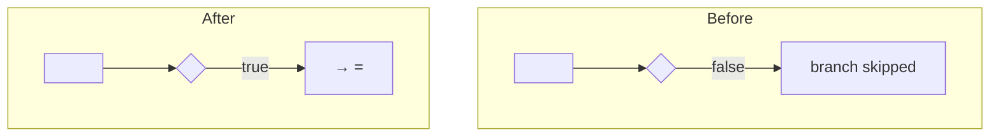

# 03 — Plan · <KEY> — <title>

<!-- Visual (D-107): the toolkit renders `03-plan.json → visual` to {{VISUAL}} (work/<KEY>/visuals/plan.html): "1 · Root cause (what
     breaks today)" · "2 · The fix, step by step" · "3 · One real example" · open questions · glossary. Write it for a non-developer.
     JSON-contract reminder — `visual` keys: issue {headline, steps[] (≥2), where_it_breaks} · fix {headline, steps[] (≥1)} = THE FIX,
     STEP BY STEP · example {record, today, expected} · mermaid {issue, fix} (each starts with flowchart/graph/sequenceDiagram/stateDiagram,
     ≥ 2 connected nodes, every box a real component) · glossary[] {term, meaning} · open_questions[].
     Self-check: `orgnauts agent visual <KEY> --stage plan`; the `visual-check` gate runs the same check. -->

## 1. Root cause
Mechanism … · Evidence: 02-repro.md, evidence/… · Confidence: xx%

## 2. Components
| Type | ApiName | Action | Why | Evidence |
|---|---|---|---|---|

## 3. Order of execution & side effects
…

### 3a. Picture — before → after the fix
<!-- D-101: the same record's journey through the order of execution, before and after, in ASCII (terminal) and mermaid
     (VS Code / GitHub). Name the real components (Type:ApiName). Then one worked example the human can check in two minutes. -->
```
BEFORE                                                  AFTER
before-save: <Flow A> --> <rule false> --> (skip)       before-save: <Flow A> --> <rule true> --> <element> sets <field>
before trigger: <Trigger> --> <Handler>                 before trigger: (unchanged)
after-save:  <Flow B> --> …                             after-save:  <Flow B> --> …
```

**Worked example:** record <shape> → before the fix: … → after the fix: … → the repro test `Class.method` flips FAIL → PASS because …

## 4. Consumers & blast radius
…

## 5. Bulk & limits
…

## 6. Tests
- Existing: … · New: `Class.method` (…) · Flow tests: … · Distribution: … · Repro test must flip to PASS: `…`

## 7. Rollback & kill switch
…

## 8. Remediation
needed: yes/no — … · verification SOQL: …

## 9. Options considered
| Option | Trade-off | Chosen? |
|---|---|---|

## Unknowns & questions for the human
- …

## Grounding table (every platform claim this plan relies on)
<!-- Source = knowledge/mirror/<file>:<line> or knowledge/curated/<file>:<line>. No line → `unverified`, and the claim also appears
     under Unknowns with the cheapest way to settle it. -->
| Claim | Source | Note |
|---|---|---|
| before-save flows run before before triggers | knowledge/mirror/…:… | |
| … | unverified | also in Unknowns |

## Checklist answers
| Item | Answer | Note |
|---|---|---|
